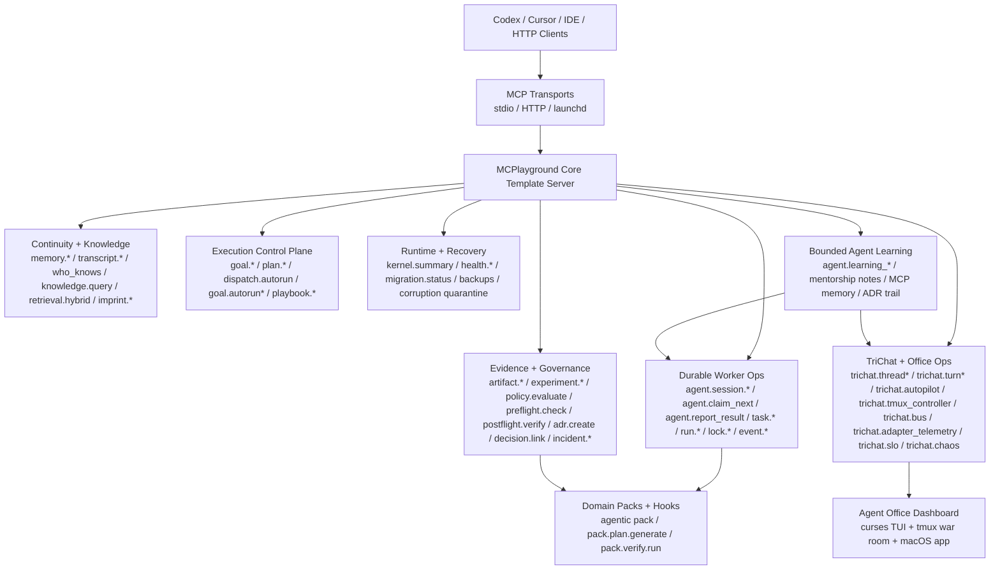
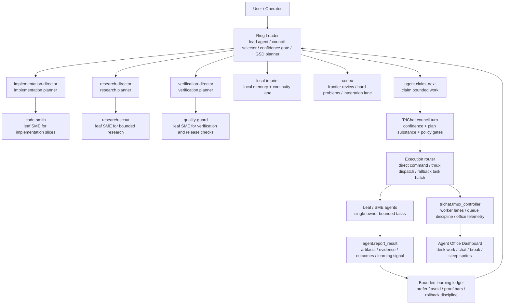
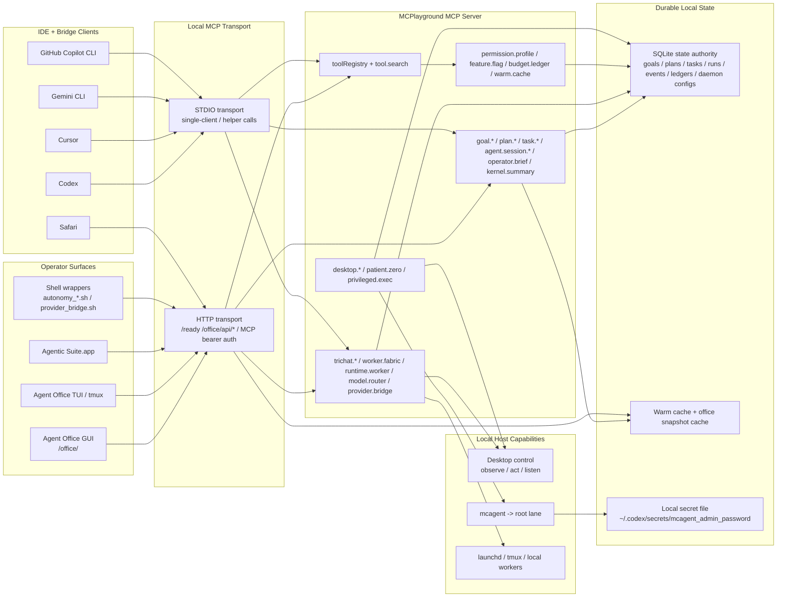
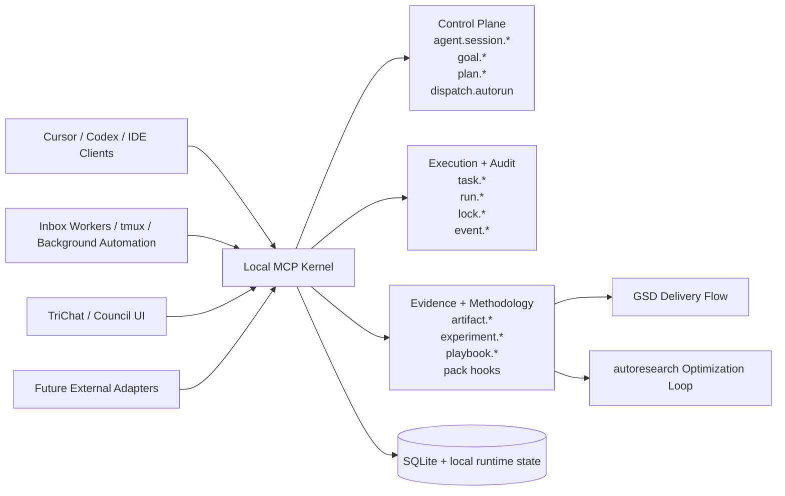

# MCPlayground Core Template

MCPlayground Core Template is a local-first MCP server runtime designed to be reused across domains.

The repository is intentionally split into two layers:

1. Core runtime: durable memory, transcripts, tasks, run ledgers, governance, ADRs, and safety checks.
2. Domain packs: optional modules that register domain-specific MCP tools without modifying core infrastructure.

This repository ships with one workflow pack by default:

- `agentic` GSD/autoresearch-inspired planner and verifier hooks for local development workflows.

The runtime also includes first-class TriChat orchestration tools (`trichat.*`) for multi-agent turns, autonomous loops, and tmux-backed nested execution control, plus the newer local control-plane surfaces:

- `tool.search` for live capability discovery from the registered MCP tool registry
- `permission.profile` for durable session permission inheritance across goals, plans, tasks, and sessions
- `budget.ledger` for append-only token/cost tracking and operator budget summaries
- `warm.cache` for startup prefetch and cached operator surfaces
- `feature.flag` for durable rollout state
- `desktop.*`, `patient.zero`, and `privileged.exec` for explicit local desktop and privileged execution lanes

## MCP Capability Wireframe

This is the operator-facing map of the current server surface.



## Agent Spawn Wireframe

This is the current ring-leader spawning and delegation shape.



## System Interconnects

This is the current end-to-end local topology: launchers, IDEs, terminal bridges, the MCP runtime, the autonomy fabric, and the local-control lanes.



Full diagrams for demos and technical walk-throughs: [System Interconnects](./docs/SYSTEM_INTERCONNECTS.md)

## Why This Template Exists

Most MCP projects repeat the same infrastructure work:

- durability and state continuity
- safe/idempotent writes
- local governance and auditability
- task orchestration
- cross-client interoperability

This template centralizes those concerns so teams can build domain tools directly.

## Client-Ready Architecture Pitch

Use this framing with stakeholders:

- This is not a single-purpose assistant.
- This is a local MCP platform with reusable reliability primitives.
- Domain value is delivered through packs, not by rewriting runtime infrastructure.



More detail: [Architecture Pitch](./docs/ARCHITECTURE_PITCH.md)

Methodology automation: [Automated GSD + autoresearch Pipeline](./docs/AUTOMATED_GSD_AUTORESEARCH_PIPELINE.md)

Execution roadmap: [Bleeding-Edge Execution Roadmap](./docs/BLEEDING_EDGE_EXECUTION_ROADMAP.md)

Execution substrate additions now shipped in core:

- `worker.fabric` for host registry, telemetry, and resource-aware lane routing
- `cluster.topology` for the durable lab plan: active Mac control plane plus planned future CPU-heavy and GPU-heavy nodes
- `model.router` for measured backend selection across local and remote model runtimes, plus topology-backed future placement recommendations for planned hosts
- `benchmark.*` and `eval.*` for isolated execution scoring and router-aware eval suites
- `task.compile` for durable DAG-style plan compilation with owner/evidence/rollback contracts
- `org.program` for versioned ring leader, director, SME, and leaf operating doctrine

Practical entrypoint:
- use `playbook.run` to instantiate a GSD/autoresearch workflow and immediately enter `goal.execute`
- let `agent.report_result` feed artifacts, experiment observations, evidence gates, and bounded `goal.autorun` continuation back into the kernel
- use `kernel.summary` for one-shot operator state and `goal.autorun_daemon` for bounded unattended continuation

## Operator Briefing

The canonical live brief surface is `operator.brief`.

- `task.compile` writes a durable `compile.brief` artifact for the active plan
- `runtime.worker` writes a concrete handoff `session_brief.md` into the worker workspace
- `office.snapshot` includes `operator_brief` so the office dashboard and GUI can consume the same canonical brief
- `operator.brief` merges current objective, delegation contract, compile brief, runtime handoff brief, and execution backlog into one operator-facing payload

Shell entrypoint:

```bash
npm run brief:current
# compact JSON for scripts / dashboards
./scripts/operator_brief.sh --json --compact
```

Raw MCP example:

```bash
node ./scripts/mcp_tool_call.mjs --tool operator.brief --args '{}' --transport http --url http://127.0.0.1:8787/ --origin http://127.0.0.1 --cwd .
```

## Provider Bridge Diagnostics

Use the provider bridge to distinguish three different states:

- client config is installed
- a provider runtime is present on this host
- the provider can actually see the shared MCP server right now

Commands:

```bash
npm run providers:status
npm run providers:diagnose -- gemini-cli cursor github-copilot-cli
```

Notes:

- Gemini CLI now installs with an explicit trusted stdio config, working directory, and timeout in `~/.gemini/settings.json`.
- Cursor is validated as configured on this host, but runtime MCP status still has to be checked in the Cursor UI because Cursor does not expose a local MCP status CLI on this machine.

## Quick Start

```bash
npm ci
npm run build
npm run start:stdio
```

## Get or Update This Repo

Fresh clone:

```bash
git clone https://github.com/driverd12/MCPlayground---Core-Template.git
cd MCPlayground---Core-Template
npm ci
npm run build
```

If you already have a local checkout:

```bash
git fetch origin
git checkout main
git pull --ff-only origin main
npm ci
npm run build
```

Start HTTP transport:

```bash
npm run start:http
```

Start pure core runtime with workflow hooks disabled:

```bash
npm run start:core
# or
npm run start:core:http
```

## TriChat TUI

Launch the BubbleTea TUI from the terminal:

```bash
npm run trichat:tui
```

Plain chat now uses direct council replies by default. Use `/plan <message>` inside the TUI when you explicitly want the structured planning/orchestration path.

Default roster:

```bash
codex,cursor,local-imprint
```

Switch the active council roster without editing code:

```bash
TRICHAT_AGENT_IDS=gemini,claude,local-imprint npm run trichat:tui
```

Launch the TUI against the local HTTP runtime:

```bash
npm run trichat:tui:http
```

Install or refresh the macOS app wrapper:

```bash
npm run trichat:app:install
```

Run launcher and bridge diagnostics before a demo:

```bash
npm run trichat:doctor
```

Inspect the effective roster:

```bash
npm run trichat:roster
node ./scripts/trichat_roster.mjs
node ./scripts/mcp_tool_call.mjs --tool trichat.roster --args '{}' --transport stdio --stdio-command node --stdio-args dist/server.js --cwd .
```

Clean stale probe threads, requeue eligible old autopilot failures, and prune untracked routine autopilot ADR residue:

```bash
npm run ring-leader:cleanup
```

Send one top-level objective into the autonomous stack so it bootstraps readiness, opens a durable goal, compiles bounded work, dispatches execution, and keeps background continuation alive:

```bash
npm run autonomy:command -- "Map the repo, implement the requested change, verify it, and keep going until the goal is truly complete."
```

Mirror an IDE/operator objective into transcript continuity, the office thread, and the same durable autonomous execution lane:

```bash
npm run autonomy:ide -- "Take what I say in the IDE, record it into MCP continuity, show it in the office, and run with it in the background."
```

Optional shell flags are available through the wrapper, for example:

```bash
./scripts/autonomy_command.sh --title "Morning autonomy smoke" --tag demo --accept "Verification evidence is attached." -- "Take this objective from intake to durable execution."
./scripts/autonomy_ide_ingress.sh --session codex-ide --thread trichat-autopilot-internal --tag ide -- "Mirror this IDE objective into the office and keep the background workflow moving."
```

If you do not explicitly override `trichat_agent_ids`, IDE ingress now defaults to a local-first council:

- `implementation-director`
- `research-director`
- `verification-director`
- `local-imprint`

That keeps the first attempt inside your local house agents before escalation.

## Agent Office Dashboard

Launch the animated office monitor directly:

```bash
npm run trichat:office
```

Launch the clickable local GUI control deck:

```bash
npm run trichat:office:gui
```

Start the tmux war room with dedicated windows for the office scene, briefing board, lane monitor, and worker queue:

```bash
npm run trichat:office:tmux
```

Open the intake desk directly when you want to hand the office a plain-language objective and let the autonomous stack run with it:

```bash
npm run autonomy:intake:shell
```

The intake desk now uses the same `autonomy.ide_ingress` path as the IDE wrapper, so office intake, Codex/IDE intake, transcript continuity, thread mirroring, memory capture, and durable background execution all stay on one real lane.

This dashboard is MCP-backed and reads live state from:

- `trichat.roster`
- `trichat.workboard`
- `trichat.tmux_controller`
- `trichat.bus`
- `trichat.adapter_telemetry`
- `task.summary`
- `trichat.summary`
- `kernel.summary`
- `patient.zero`
- `privileged.exec`
- `budget.ledger`
- `feature.flag`
- `warm.cache`

The `/office/` GUI is served directly by the HTTP transport. Under normal polling it prefers cached office snapshots; explicit operator actions and forced refreshes are the only paths that demand live snapshot work.

The office scene keeps working agents at their desks, moves active chatter to the coffee and water cooler strip, shows resets in the lounge, and parks long-idle agents on the sofa in sleep mode. Action badges reflect real MCP/tmux signals such as desk work, briefing, chatting, break/reset, blocked, offline, and sleep.

Recent polish added:

- a stylized night-shift office banner with a built-in mascot and richer ASCII sprite poses
- animated per-agent states for desk work, supervision, chatter, break, blocked, offline, and sleep
- a `t` hotkey to cycle dashboard themes (`night`, `sunrise`, `mono`)
- a dedicated `intake` tmux window and `5` hotkey from the office dashboard so the war room can take objectives, not just monitor them
- confidence-check surfacing in the briefing board so ring-leader confidence is explainable, not just numeric

Install the single-click macOS app launcher in `/Applications`:

```bash
npm run trichat:app:install
```

By default the app opens the built-in `/office/` GUI and keeps the tmux-backed Agent Office substrate available underneath it. If you do not pass `--icon`, it generates its own built-in office mascot icon.

Install the umbrella launcher for the broader local suite:

```bash
npm run agentic:suite:app:install
```

That launcher brings up the Agent Office web surface and opens the local desktop tools listed in `AGENTIC_SUITE_OPEN_APPS` (defaults to `Codex,Cursor`).

Keyboard controls inside the TUI:

- `1` office
- `2` briefing
- `3` lanes
- `4` workers
- `h` help
- `r` refresh
- `p` pause
- `t` cycle theme
- `q` quit

## Borrowed Wins

The current office/TriChat environment intentionally borrows and reinterprets the strongest open-source ideas from:

- [RALPH TUI](https://github.com/subsy/ralph-tui): multi-pane operator UX, persistent dashboard feel, session-oriented monitoring, and a more playful terminal surface
- [Get Shit Done](https://github.com/gsd-build/get-shit-done): bounded work packets, single-owner delegation, and orchestration that stays simple while the system grows complex
- [autoresearch](https://github.com/karpathy/autoresearch): small-budget experiment loops, org-first task shaping, and disciplined overnight continuation
- [SuperClaude Framework](https://github.com/SuperClaude-Org/SuperClaude_Framework): confidence-before-action methodology and explicit mode/check thinking before implementation

We also reviewed the DAN-prompt gist for stylistic inspiration only. Unsafe jailbreak behavior is intentionally excluded; the only acceptable lift is playful operator-facing mode naming, not guardrail bypassing.

Upstream coverage matrix: [Upstream Implementation Matrix](./docs/UPSTREAM_IMPLEMENTATION_MATRIX.md)

## Replication Bundle

When GitHub push access is unavailable, export a portable handoff bundle for a stronger server:

```bash
npm run replication:export
```

The export includes:

- a `git bundle` for the current branch and commit
- `.env.example`
- `config/trichat_agents.json`
- `bootstrap-server.sh`
- `replication-manifest.json`

On the target server:

```bash
./bootstrap-server.sh /path/to/target /path/to/MCPlayground---Core-Template-<timestamp>.bundle
```

## Configuration

Copy the template:

```bash
cp .env.example .env
```

Key variables:

- `ANAMNESIS_HUB_DB_PATH` local SQLite path
- `ANAMNESIS_HUB_RUN_QUICK_CHECK_ON_START` run SQLite quick integrity check at startup (`1` by default)
- `ANAMNESIS_HUB_STARTUP_BACKUP` create rotating startup snapshots (`1` by default)
- `ANAMNESIS_HUB_BACKUP_DIR` snapshot directory (default: sibling `backups/` near DB path)
- `ANAMNESIS_HUB_BACKUP_KEEP` retained snapshot count (default: `24`)
- `ANAMNESIS_HUB_AUTO_RESTORE_FROM_BACKUP` auto-restore latest snapshot on startup corruption (`1` by default)
- `ANAMNESIS_HUB_ALLOW_FRESH_DB_ON_CORRUPTION` allow empty DB bootstrap if no backup exists (`0` by default)
- `MCP_HTTP_BEARER_TOKEN` auth token for HTTP transport
- `MCP_HTTP_ALLOWED_ORIGINS` comma-separated local origins
- `MCP_DOMAIN_PACKS` comma-separated pack ids (`agentic`, etc.); defaults to `agentic`, set `none` to disable all packs
- `TRICHAT_AGENT_IDS` comma-separated active TriChat roster
- `TRICHAT_GEMINI_CMD` override full Gemini bridge command
- `TRICHAT_CLAUDE_CMD` override full Claude bridge command
- `TRICHAT_GEMINI_EXECUTABLE` / `TRICHAT_GEMINI_ARGS` provider CLI override
- `TRICHAT_CLAUDE_EXECUTABLE` / `TRICHAT_CLAUDE_ARGS` provider CLI override
- `TRICHAT_CODEX_EXECUTABLE` / `TRICHAT_CURSOR_EXECUTABLE` override the provider binary inside the wrapper
- `TRICHAT_GEMINI_MODE` select `auto`, `cli`, or `api`
- `TRICHAT_GEMINI_MODEL` override Gemini API model (`gemini-2.0-flash` default)
- `TRICHAT_IMPRINT_MODEL` / `TRICHAT_OLLAMA_URL` control the local imprint lane
- `TRICHAT_LOCAL_INFERENCE_PROVIDER` selects `auto`, `ollama`, or `mlx` for the local bridge lane
- `TRICHAT_MLX_PYTHON` / `TRICHAT_MLX_MODEL` / `TRICHAT_MLX_ENDPOINT` define the optional Metal-backed MLX lane
- `TRICHAT_MLX_SERVER_ENABLED=1` enables a managed local `mlx_lm.server` launch agent; leave it `0` to keep MLX installed but not auto-served
- `TRICHAT_BRIDGE_TIMEOUT_SECONDS` bound per-bridge request time
- `TRICHAT_BRIDGE_MAX_RETRIES` / `TRICHAT_BRIDGE_RETRY_BASE_MS` control wrapper-level transient retry behavior
- `GEMINI_API_KEY` or `GOOGLE_API_KEY` enable direct Gemini API fallback

The runtime now quarantines non-SQLite/corrupted artifacts into `corrupt/` before recovery attempts so startup failures do not silently overwrite evidence.

Local Metal setup:

- `npm run mlx:setup` creates `.venv-mlx`, installs `mlx` + `mlx-lm`, and writes the repo-local MLX env vars into `.env`
- the control plane now prefers the repo’s `.venv-mlx/bin/python` when probing MLX availability
- local bridges can use the MLX chat-completions endpoint when `TRICHAT_LOCAL_INFERENCE_PROVIDER=mlx` or `auto` with a healthy MLX endpoint

## Core Tool Surface

Core runtime tools include:

- Memory and continuity: `memory.*`, `transcript.*`, `who_knows`, `knowledge.query`, `retrieval.hybrid`
- Governance and safety: `policy.evaluate`, `preflight.check`, `postflight.verify`, `mutation.check`
- Durable execution: `run.*`, `task.*`, `lock.*`
- Agentic kernel: `goal.*` including `goal.execute`, `goal.autorun`, and `goal.autorun_daemon`, `kernel.summary`, `plan.*`, `artifact.*`, `experiment.*`, `event.*`, `agent.session.*`, `dispatch.autorun`
- Workflow methodology: `playbook.*` including `playbook.run`, `pack.hooks.list`, `pack.plan.generate`, `pack.verify.run`
- Decision and incident logging: `adr.create`, `decision.link`, `incident.*`
- Runtime ops: `health.*`, `migration.status`, `imprint.*`, `imprint.inbox.*`
- TriChat orchestration: `trichat.*` (`roster`, `thread/message/turn`, `autopilot`, `tmux_controller`, `bus`, `adapter_telemetry`, `chaos`, `slo`)
- Control-plane discovery and rollout: `tool.search`, `permission.profile`, `feature.flag`, `warm.cache`
- Budget and cost visibility: `budget.ledger`
- Local host control: `desktop.control`, `desktop.observe`, `desktop.act`, `desktop.listen`, `patient.zero`, `privileged.exec`

## Domain Pack Framework

Workflow/domain packs are loaded at startup from `MCP_DOMAIN_PACKS` or `--domain-packs`.

- Framework: `src/domain-packs/types.ts`, `src/domain-packs/index.ts`
- Default workflow pack: `src/domain-packs/agentic.ts`

Pack authoring guide: [Domain Packs](./docs/DOMAIN_PACKS.md)

## IDE and Agent Setup

Connection examples and client setup:

- [IDE + Agent Setup Guide](./docs/IDE_AGENT_SETUP.md)
- [Transport Connection Guide](./docs/CONNECT.md)
- [Coworker Quickstart (Cursor + Codex)](./docs/COWORKER_QUICKSTART_CURSOR_CODEX.md)
- [Provider Bridge Matrix](./docs/PROVIDER_BRIDGE_MATRIX.md)
- [System Interconnects](./docs/SYSTEM_INTERCONNECTS.md)
- [Presentation Runbook](./docs/PRESENTATION_RUNBOOK.md)
- [Ring Leader MCP Ops](./docs/RING_LEADER_MCP_OPS.md)

Provider bridge commands:

```bash
npm run providers:status
npm run providers:export
npm run providers:install -- cursor gemini-cli github-copilot-cli
```

`provider.bridge` is the truthful federation surface:

- it reports which clients can really connect into this MCP runtime
- it reports which providers are already available as live outbound council agents
- it projects runtime-eligible outbound providers into bridge-backed `model.router` backend candidates
- `autonomy.bootstrap` seeds those eligible bridge backends automatically without replacing the local default backend
- `autonomy.command`, `goal.execute`, and `plan.dispatch` use router output to augment local-first councils with relevant hosted agents instead of treating provider bridges as a separate side path
- it exports config bundles for Cursor, Gemini CLI, GitHub Copilot, and Codex
- it installs both global and workspace-local Cursor MCP config for better editor reliability
- it defaults Gemini CLI to stdio MCP transport for better local compatibility
- it preserves `autonomy.ide_ingress` as the one canonical operator/IDE ingress path

Fast STDIO connection example:

```json
{
  "mcpServers": {
    "mcplayground-core-template": {
      "command": "node",
      "args": ["/absolute/path/to/MCPlayground---Core-Template/dist/server.js"],
      "env": {
        "ANAMNESIS_HUB_DB_PATH": "/absolute/path/to/MCPlayground---Core-Template/data/hub.sqlite"
      }
    }
  }
}
```

Pure core / no-pack connection example:

```json
{
  "mcpServers": {
    "mcplayground-core-only": {
      "command": "node",
      "args": ["/absolute/path/to/MCPlayground---Core-Template/dist/server.js"],
      "env": {
        "ANAMNESIS_HUB_DB_PATH": "/absolute/path/to/MCPlayground---Core-Template/data/hub.sqlite",
        "MCP_DOMAIN_PACKS": "none"
      }
    }
  }
}
```

## Agentic Fork Path

How to publish an agentic-development-focused fork from this template:

- [Agentic Fork Guide](./docs/AGENTIC_FORK_GUIDE.md)

## Validation

```bash
npm test
npm run mvp:smoke
npm run agentic:micro-soak
```

Local HTTP teammate validation:

```bash
npm run launchd:install
npm run it:http:validate
```

TriChat reliability checks:

```bash
npm run trichat:bridges:test
npm run trichat:doctor
npm run production:doctor
npm run autonomy:status
npm run autonomy:maintain
npm run trichat:smoke
npm run trichat:dogfood
npm run trichat:soak:gate -- --hours 1 --interval-seconds 60
```

Background upkeep is real, not advisory: launchd keepalive now drives `autonomy.maintain`, which keeps the control plane ready, keeps `goal.autorun_daemon` alive, refreshes bounded learning visibility, maintains tmux worker lanes, and runs the default eval suite only when it is due.

Alternate roster validation example:

```bash
TRICHAT_AGENT_IDS=gemini,claude,local-imprint npm run trichat:doctor
```

TriChat tmux controller dry-run example:

```bash
TRICHAT_TMUX_DRY_RUN=1 node scripts/mcp_tool_call.mjs \
  --tool trichat.tmux_controller \
  --args '{"action":"start","mutation":{"idempotency_key":"demo-start","side_effect_fingerprint":"demo-start"}}'
```

`trichat.tmux_controller` status/dispatch responses include a lightweight live dashboard payload for TUIs:

- `dashboard.worker_load` (queue/load per worker)
- `dashboard.worker_load[].lane_state` + `lane_signal` (idle/working/blocked/error lane detection from pane captures)
- `dashboard.queue_age_seconds` + `dashboard.queue_depth`
- `dashboard.failure_class` + `dashboard.failure_count`
- `action="maintain"` performs unattended upkeep: pane sync, optional queue-driven worker scale-up, and blocked-lane nudge attempts for continuous long-running sessions

Execution safety hardening:

- protected DB artifacts (`hub.sqlite`, `-wal`, `-shm`, `-journal`) are now blocked from autopilot command plans and tmux dispatch tasks
- direct autopilot shell execution also enforces this guardrail as a final pre-spawn check
- local write-producing MCP tools (`adr.create`, `imprint.inbox.enqueue`, `imprint.snapshot`) now enforce protected-path checks before writing

TriChat TUI interactive `/execute` can route via tmux allocator (`TRICHAT_EXECUTE_BACKEND=auto|tmux|direct`) using:

- `TRICHAT_TMUX_SESSION_NAME`
- `TRICHAT_TMUX_WORKER_COUNT`
- `TRICHAT_TMUX_MAX_QUEUE_PER_WORKER`
- `TRICHAT_TMUX_SYNC_AFTER_DISPATCH`
- `TRICHAT_TMUX_LOCK_LEASE_SECONDS`

Optional fanout auto-dispatch (no manual `/execute`) can be enabled with `TRICHAT_AUTO_EXECUTE_AFTER_DECISION=1`.
This path is tmux-dispatch-first for snappiness and will skip with a clear status if no runnable command plan is present.
Use `TRICHAT_AUTO_EXECUTE_CYCLES` and `TRICHAT_AUTO_EXECUTE_BREAKER_FAILURES` to run bounded review/fix/feature/verify cycles with breaker halts.

Autopilot can use tmux nested execution directly (`execute_backend=tmux|auto`) with dynamic worker budgeting from command complexity/priority:

```bash
TRICHAT_TMUX_DRY_RUN=1 node scripts/mcp_tool_call.mjs \
  --tool trichat.autopilot \
  --args '{
    "action":"run_once",
    "mutation":{"idempotency_key":"demo-autopilot","side_effect_fingerprint":"demo-autopilot"},
    "execute_backend":"tmux",
    "tmux_session_name":"trichat-autopilot-demo",
    "tmux_worker_count":4,
    "tmux_auto_scale_workers":true
  }'
```

## Repository Layout

- `src/server.ts` core MCP runtime and tool registration
- `src/tools/` core reusable tools
- `src/domain-packs/` optional domain modules
- `scripts/` operational scripts and smoke checks
- `docs/` architecture, setup, and fork guides
- `tests/` integration and persistence tests
- `data/` local runtime state and SQLite database
