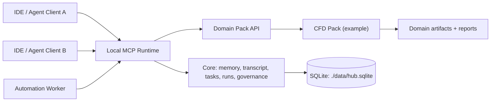

# MCPlayground Core Template

MCPlayground Core Template is a local-first MCP server runtime designed to be reused across domains.

The repository is intentionally split into two layers:

1. Core runtime: durable memory, transcripts, tasks, run ledgers, governance, ADRs, and safety checks.
2. Domain packs: optional modules that register domain-specific MCP tools without modifying core infrastructure.

This repository ships with one reference pack:

- `cfd` Computational Fluid Dynamics lifecycle tooling.

## Why This Template Exists

Most MCP projects repeat the same infrastructure work:

- durability and state continuity
- safe/idempotent writes
- local governance and auditability
- task orchestration
- cross-client interoperability

This template centralizes those concerns so teams can build domain tools directly.

## Client-Ready Architecture Pitch

Use this framing with stakeholders:

- This is not a single-purpose assistant.
- This is a local MCP platform with reusable reliability primitives.
- Domain value is delivered through packs, not by rewriting runtime infrastructure.



More detail: [Architecture Pitch](./docs/ARCHITECTURE_PITCH.md)

## Quick Start

```bash
npm ci
npm run build
npm run start:stdio
```

## Get or Update This Repo

Fresh clone:

```bash
git clone https://github.com/driverd12/MCPlayground---Core-Template.git
cd MCPlayground---Core-Template
npm ci
npm run build
```

If you already have a local checkout:

```bash
git fetch origin
git checkout main
git pull --ff-only origin main
npm ci
npm run build
```

Start HTTP transport:

```bash
npm run start:http
```

Start with CFD pack enabled:

```bash
npm run start:cfd
# or
npm run start:cfd:http
```

## Configuration

Copy the template:

```bash
cp .env.example .env
```

Key variables:

- `ANAMNESIS_HUB_DB_PATH` local SQLite path
- `MCP_HTTP_BEARER_TOKEN` auth token for HTTP transport
- `MCP_HTTP_ALLOWED_ORIGINS` comma-separated local origins
- `MCP_DOMAIN_PACKS` comma-separated pack ids (`cfd`, etc.)

## Core Tool Surface

Core runtime tools include:

- Memory and continuity: `memory.*`, `transcript.*`, `who_knows`, `knowledge.query`, `retrieval.hybrid`
- Governance and safety: `policy.evaluate`, `preflight.check`, `postflight.verify`, `mutation.check`
- Durable execution: `run.*`, `task.*`, `lock.*`
- Decision and incident logging: `adr.create`, `decision.link`, `incident.*`
- Runtime ops: `health.*`, `migration.status`, `imprint.*`, `imprint.inbox.*`

## Domain Pack Framework

Domain packs are loaded at startup from `MCP_DOMAIN_PACKS` or `--domain-packs`.

- Framework: `src/domain-packs/types.ts`, `src/domain-packs/index.ts`
- Reference pack: `src/domain-packs/cfd.ts`

Pack authoring guide: [Domain Packs](./docs/DOMAIN_PACKS.md)

## IDE and Agent Setup

Connection examples and client setup:

- [IDE + Agent Setup Guide](./docs/IDE_AGENT_SETUP.md)
- [Transport Connection Guide](./docs/CONNECT.md)

Fast STDIO connection example:

```json
{
  "mcpServers": {
    "mcplayground-core-template": {
      "command": "node",
      "args": ["/absolute/path/to/MCPlayground---Core-Template/dist/server.js"],
      "env": {
        "ANAMNESIS_HUB_DB_PATH": "/absolute/path/to/MCPlayground---Core-Template/data/hub.sqlite"
      }
    }
  }
}
```

Fast CFD-enabled connection example:

```json
{
  "mcpServers": {
    "mcplayground-cfd": {
      "command": "node",
      "args": ["/absolute/path/to/MCPlayground---Core-Template/dist/server.js"],
      "env": {
        "ANAMNESIS_HUB_DB_PATH": "/absolute/path/to/MCPlayground---Core-Template/data/hub.sqlite",
        "MCP_DOMAIN_PACKS": "cfd"
      }
    }
  }
}
```

## CFD Fork Path

How to publish a CFD-focused fork from this template:

- [CFD Fork Guide](./docs/CFD_FORK_GUIDE.md)

## Validation

```bash
npm test
npm run mvp:smoke
```

## Repository Layout

- `src/server.ts` core MCP runtime and tool registration
- `src/tools/` core reusable tools
- `src/domain-packs/` optional domain modules
- `scripts/` operational scripts and smoke checks
- `docs/` architecture, setup, and fork guides
- `tests/` integration and persistence tests
- `data/` local runtime state and SQLite database
