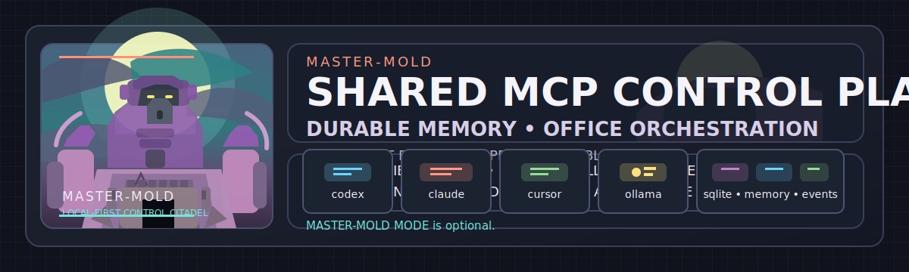
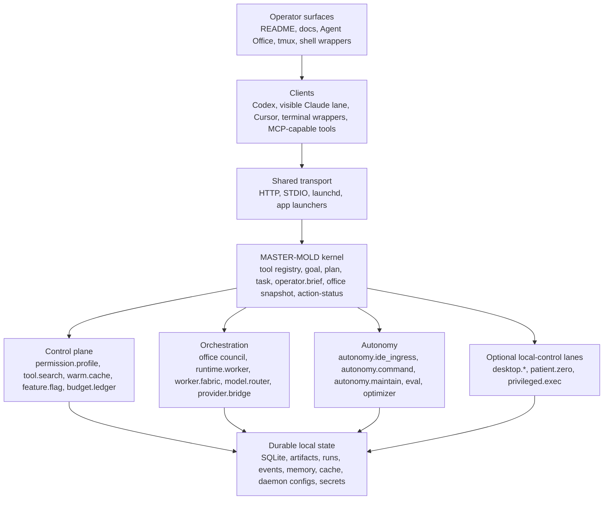
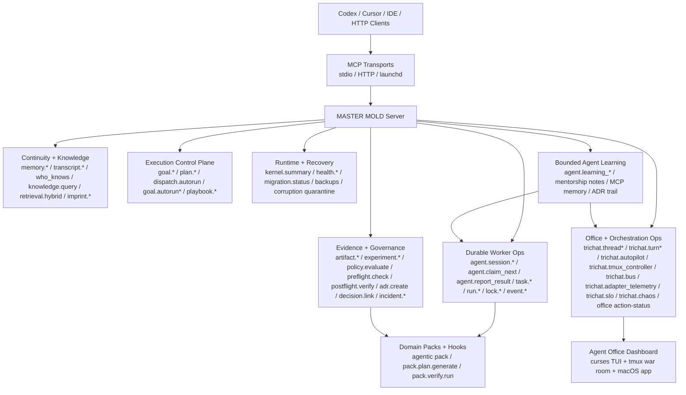
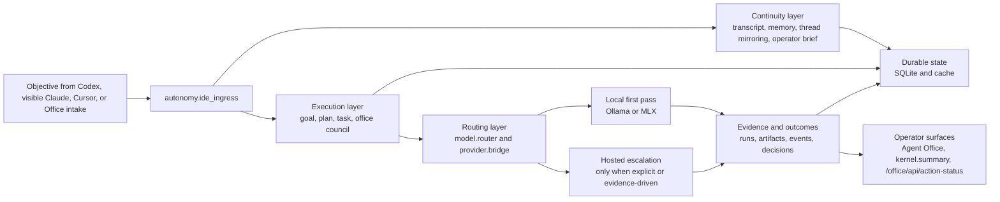
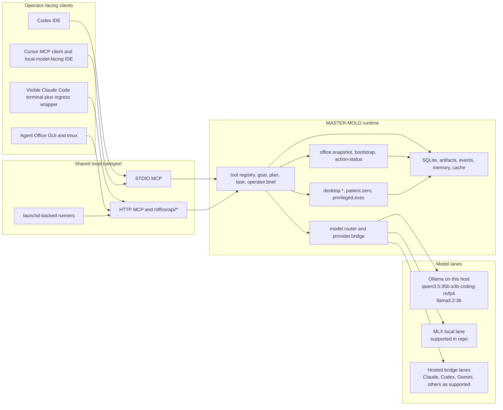
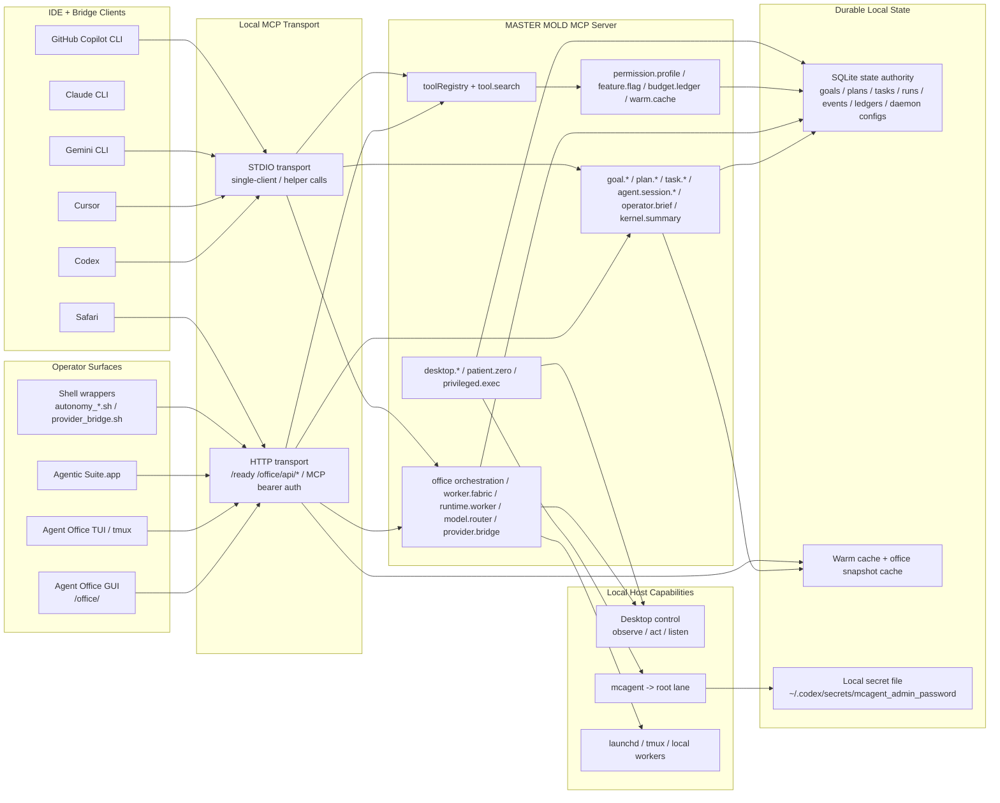
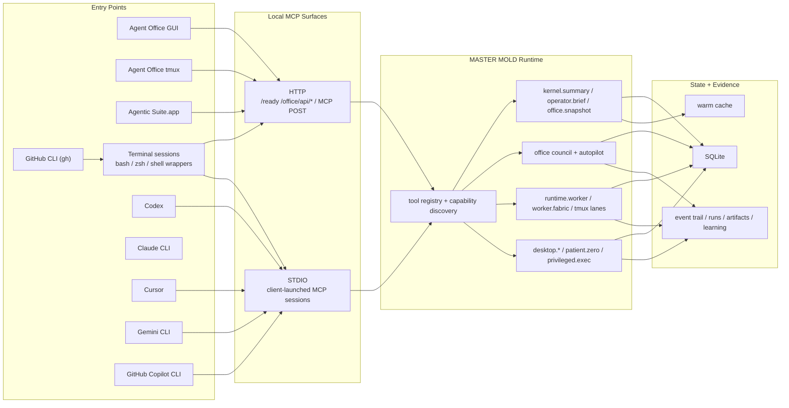
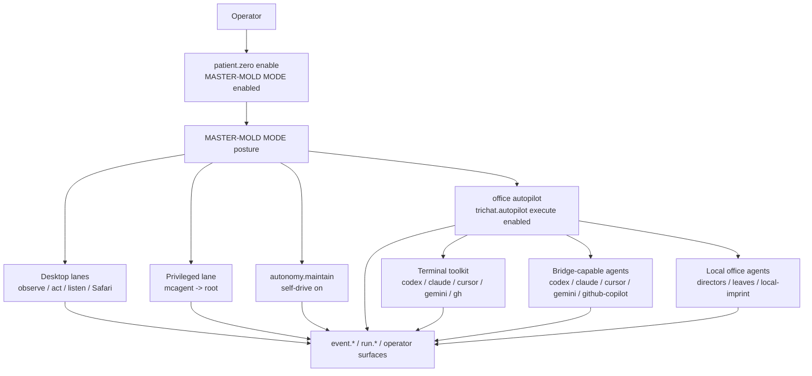

# MASTER MOLD: Shared Local MCP Control Plane for Operator-Visible AI Work



`MASTER-MOLD` is a local-first Model Context Protocol runtime that gives multiple AI clients one shared system instead of a pile of disconnected chat tabs. It combines a shared MCP control plane, durable memory and state, orchestration, office/operator surfaces, local-first model routing, and optional local host-control lanes.

If you need to present this repo quickly, read sections `1` through `15` in order. Sections `4` through `11` are the architecture and mode wireframes; the rest of the README is setup, commands, and deeper operator detail.

## 60-Second Pitch

`MASTER-MOLD` is the shared local layer beneath the agents. Codex, visible Claude Code in Terminal, Cursor, and local model lanes can all connect through the same runtime. Objectives come in through one ingress path, state lands in SQLite, artifacts, runs, events, and memory instead of disappearing into chat history, local inference gets first pass before hosted escalation, and the operator can watch or steer the system through Agent Office and other local surfaces. It is useful today, but not every bridge or Office surface is equally reliable, and live office rally under heavy load is still not fully solved.

## 1. What MASTER-MOLD Is

At repo level, `MASTER-MOLD` does four jobs:

- shared MCP control plane for multiple clients and operator surfaces
- durable memory and state layer for goals, plans, tasks, runs, events, artifacts, ledgers, and continuity
- orchestration layer for office turns, worker routing, councils, and background execution
- local-first AI toolbench for Ollama/MLX-first routing before hosted escalation

Repository shape:

- Core runtime: durable memory, transcripts, tasks, run ledgers, governance, ADRs, safety checks, operator surfaces, and routing infrastructure
- Domain packs: optional modules that register domain-specific MCP tools without rewriting core infrastructure
- Default workflow pack: `agentic`

Important scope boundary:

- `MASTER-MOLD` is the base system
- `MASTER-MOLD MODE` is the operator-facing name for the optional fully armed local-control posture on top of that base system

Implementation boundary:

- the runtime and tool surface still use internal names such as `patient.zero`, `patient_zero_enable`, and `patient_zero_disable`
- the README and Office UI call that posture `MASTER-MOLD MODE`

`MASTER-MOLD MODE` matters, but it should not be the first mental model. The first mental model is shared control plane plus durable state. The fully armed desktop/browser/root posture is a later, explicit escalation.

## 2. Why It Is Worth Having

This repo exists because most multi-agent setups lose time and trust in the same places:

- context has to be reloaded separately in every client
- orchestration logic lives in chat transcripts instead of durable state
- model routing is ad hoc and hard to inspect
- operator visibility is weaker than the autonomy being claimed
- local inference is available but not treated as the default first-pass lane

What `MASTER-MOLD` buys in practical terms:

- continuity across sessions and clients
- less repeated setup and less repeated context loading
- more controlled orchestration through one ingress and one state authority
- better operator visibility through Office, status tools, and explicit bridge truth
- cheaper local inference where local models are good enough
- launchd-backed resilience instead of relying on a single live shell session

## 3. Ground-Up Runtime Stack



Read this stack from top to bottom:

1. The operator works through local surfaces and connected clients.
2. Those clients share one transport and one runtime instead of keeping separate hidden state.
3. The runtime turns chat-like requests into goals, plans, tasks, events, artifacts, and memory.
4. That state stays durable on disk and becomes reusable across future sessions.

## 4. Control-Plane Capability Wireframe

This is the operator-facing map of the current server surface.



This diagram is the shortest honest answer to “what actually lives inside the runtime?”

- continuity and retrieval
- control and dispatch
- evidence and governance
- Office and orchestration
- runtime health and recovery
- bounded learning

## 5. Agent Spawn Wireframe

This is the current ring-leader spawning and delegation shape.


This matters because the repo is not just “one assistant with tools.” It has a real delegation shape:

- ring leader and council
- directors and bounded specialists
- tmux and worker lanes
- durable evidence and learning loops

## 6. How Day-to-Day Work Changes

The canonical operator and IDE ingress is `autonomy.ide_ingress`. That is the lane that turns a one-off request into durable work.



In practical day-to-day terms:

1. The operator gives the system an objective.
2. The objective enters through one real ingress path.
3. The runtime mirrors that work into continuity, office surfaces, and durable state.
4. The router prefers local inference first.
5. Hosted bridges are added intentionally, not by default theater.
6. The outcome stays queryable later through memory, artifacts, runs, events, and operator surfaces.

## 7. How the Main Clients and Model Lanes Connect



What that means for the main operator lanes:

- Codex: connects into the same MCP runtime and can also be targeted through bridge-backed orchestration paths
- visible Claude Code in Terminal: the visible terminal lane is real on this repo, but durable execution should still go through the MCP ingress path rather than staying as chat-only terminal history
- Cursor: works best here as an MCP client and local-model-facing IDE, with local backend selection staying durable in `MASTER-MOLD` instead of disappearing into editor state
- local Ollama and MLX: the repo supports local-first routing through `model.router`; local backends should be the first-pass lane before hosted escalation
- office and control-plane surfaces: `/office/`, `/office/api/bootstrap`, `/office/api/action-status`, `office.snapshot`, and `operator.brief` exist to keep the operator in the loop
- durable state: SQLite, artifacts, runs, events, memory, cache, and related records are the long-lived system of record

## 8. System Interconnects

This is the current end-to-end local topology: launchers, IDEs, terminal bridges, the MCP runtime, the autonomy fabric, and the local-control lanes.



Full diagrams for demos and technical walk-throughs: [System Interconnects](./docs/SYSTEM_INTERCONNECTS.md)

## 9. IDE, CLI, and Office Flow



## 10. MASTER-MOLD MODE End-State

`MASTER-MOLD MODE` is the operator-facing name for the repo's explicit high-risk local-control posture. Internally, the runtime still implements it through `patient.zero` and related actions.

When enabled, `MASTER-MOLD MODE` ties the stack together:

- office and council orchestration
- autonomous continuation through `autonomy.maintain`
- CLI and IDE bridge usage across Codex, Claude CLI, Cursor, Gemini CLI, GitHub Copilot CLI, and `gh`
- local desktop/browser/root-capable host-control lanes
- full auditability through runtime events, runs, ledgers, and operator surfaces

This is not the base runtime. It is the optional escalated posture on top of the base runtime.

## 11. MASTER-MOLD MODE Interconnect



`MASTER-MOLD MODE` is where the repo’s local host-control story, Office orchestration story, and audit story fully intersect.

## 12. Current Operator Host Snapshot (April 20, 2026)

This section is intentionally host-specific and date-specific.

Primary operator focus on this machine:

- Codex IDE
- visible Claude Code in Terminal
- local Ollama models
- Cursor as an MCP client and local-model-facing IDE

Verified local Ollama models on this host as of April 20, 2026:

- `qwen3.5:35b-a3b-coding-nvfp4`
- `llama3.2:3b`

Reality boundary:

- the repo supports MLX and hosted bridge lanes
- this README only claims the Ollama inventory above as locally verified on this host

## 13. What Is Real Today

These claims are grounded in the current repo docs and implementation, not aspiration:

- There is one real shared MCP runtime that can be reached through STDIO or HTTP.
- `autonomy.ide_ingress` is the canonical shared intake path for operator and IDE objectives.
- Durable state is real: goals, plans, tasks, runs, events, artifacts, memory, and caches live in local state instead of staying trapped in one client transcript.
- Visible Claude Code in Terminal is real on this repo, and explicit target-agent ingress for `claude`, `codex`, `cursor`, and `gemini` is implemented.
- Cursor local-first mode is real: `model.router` exposes `local_status` and `select_local_backend`, and the durable control plane remains `MASTER-MOLD`, not Cursor chat state.
- Provider bridge truth is real: the repo distinguishes installable, configured, connected, export-only, and remote-only paths instead of flattening them into one claim.
- Agent Office is real as an operator visibility surface, with HTTP and tmux-backed lanes.
- Launchd-backed resilience is real, and launcher truth has been hardened so stale repo-bound LaunchAgents are cleared and rewritten for the current repo path instead of being treated as healthy by default.
- Office action tracking is real: office actions expose `/office/api/action-status`, and the GUI no longer depends on an immediate post-submit snapshot refresh to show progress.
- Truthful cache fallback is real: the HTTP readiness and office snapshot paths prefer explicit cache and stale markers over blocking the whole surface when live snapshot work is slow.
- `MASTER-MOLD MODE` is real as an optional posture for explicit local-control lanes, but it is permission-gated and auditable, not magic.

## 14. Current Gaps / What Is Still Not Fully Solved

These gaps should be said plainly:

- Under heavy live intake or office rally load, `/ready`, `/office/`, and `/office/api/bootstrap` can still transiently stall.
- During that window, `/office/api/action-status` is the more reliable rally signal.
- The Office GUI is useful and increasingly truthful, but it is not perfect; some flows still degrade to cached or stale-but-explicit snapshot reads.
- Not every provider or bridge is equally reliable, and `configured` does not mean `authenticated`, `connected`, or `runtime-ready`.
- Not every automation or autonomy surface is production-perfect yet.
- Live office rally under load is improved, but it is not fully solved.
- `MASTER-MOLD MODE` full authority is gated by macOS-owned permissions and root-helper readiness; an enabled posture does not bypass OS blockers.
- MLX, adapter, and broader local-model lanes exist in the repo, but host-specific reality still has to be verified before claiming a given lane is live.

## 15. Why This Still Matters Despite the Gaps

Even with those caveats, `MASTER-MOLD` already changes the operator experience in ways that are hard to get back once you have them:

- shared context across Codex, visible Claude, Cursor, and office surfaces
- durable memory and state instead of chat-only context
- local-first inference before hosted escalation
- more controlled orchestration with one ingress and one state authority
- better operator visibility into what the system is actually doing
- cheaper and more inspectable local inference where the local lane is good enough
- more resilience than a purely manual, shell-only setup

## 16. Guided Walkthrough

If you need to present this repo quickly, use this order:

1. Start with sections `1` and `2`: define `MASTER-MOLD` as shared control plane, memory layer, orchestration layer, and local-first toolbench.
2. Show section `3`: explain the stack from operator surface down to durable state.
3. Show sections `4` and `5`: explain what capabilities live inside the control plane and how delegation actually works.
4. Show sections `6` and `7`: explain how objectives become durable work and how Codex, visible Claude Code, Cursor, and the local model lanes connect.
5. Use sections `8` and `9` when you need the larger topology diagrams for Office, HTTP/STDIO, and the live operator surfaces.
6. Use sections `10` and `11` to explain the explicit high-risk local-control posture as `MASTER-MOLD MODE`.
7. Call out section `12`: keep the host-specific model inventory and operator focus concrete.
8. Say section `13` before section `14`: lead with what is proven, then say what is incomplete.
9. End on section `15`: explain why the investment still pays off despite the gaps.

Useful demo commands if you want to move from explanation into live proof:

```bash
npm run providers:status
npm run trichat:office:web
npm run claude:terminal
npm run autonomy:ide -- "Take this objective, mirror it into continuity and the office, let the local-first council attempt it first, and continue in the background."
```

## Documentation Hub

Use this README as the guided operator story. Use the docs below for source detail and deeper implementation context:

- [Documentation Index](./docs/README.md)
- [Quick Setup](./docs/SETUP.md)
- [System Interconnects](./docs/SYSTEM_INTERCONNECTS.md)
- [IDE + Agent Setup Guide](./docs/IDE_AGENT_SETUP.md)
- [Claude CLI + Codex Symbiosis](./docs/CLAUDE_CODEX_SYMBIOSIS.md)
- [Cursor Local-First Mode](./docs/CURSOR_LOCAL_FIRST_MODE.md)
- [Provider Bridge Matrix](./docs/PROVIDER_BRIDGE_MATRIX.md)
- [Transport Connection Guide](./docs/CONNECT.md)
- [Presentation Runbook](./docs/PRESENTATION_RUNBOOK.md)
- [TriChat Compatibility Reference](./docs/TRICHAT_COMPATIBILITY_REFERENCE.md)

Root-level companion files intentionally left outside `docs/`:

- `AGENTS.md` for coding-agent operating instructions
- `GEMINI.md` for Gemini-specific local notes

## Quick Start

```bash
npm run bootstrap:env
npm run start:stdio
```

If this is your first time with MASTER MOLD, think of it as a local AI-agent toolbench rather than a normal app you click through manually. You bootstrap the base runtime, then your MCP-capable AI client uses the tools here to build and adapt project-specific scaffolding, status surfaces, memories, and workflows.

On macOS, do not start with `brew install npm` by itself. That often leaves your terminal on the latest Node/npm pair, which can overshoot this repo's supported range. Use `npm run bootstrap:env:install` or install `node@22` first, then rerun the bootstrap.

On Windows, use the `npm run ...` scripts exactly as shown. Do not manually type bash-style environment prefixes such as `MCP_HTTP=1 node ...`; `npm run start:http` handles that in cross-platform Node code.

## Get or Update This Repo

Fresh clone:

```bash
git clone https://github.com/driverd12/MASTER-MOLD.git
cd master-mold
npm run bootstrap:env
```

If you already have a local checkout:

```bash
git fetch origin
git checkout main
git pull --ff-only origin main
npm run bootstrap:env
```

If `npm ci` says `EBADENGINE`, stop there and run `npm run bootstrap:env:install`. The repo now hard-stops early on unsupported Node/npm versions and points back to the pinned runtime path.

When `npm run doctor` ends with `Result: ready`, the core MCP setup is complete. Any remaining recommendations are optional lanes such as HTTP auth, `MASTER-MOLD MODE`/full-device-control permissions, local training, tmux, Ollama, or provider bridges you have not chosen to activate yet.

Start HTTP transport:

```bash
npm run start:http
```

If Windows prints `'MCP_HTTP' is not recognized`, that checkout is old or a direct shell command was copied. Pull latest `main` and run the npm script above.

Start pure core runtime with workflow hooks disabled:

```bash
npm run start:core
# or
npm run start:core:http
```

## Office TUI and Council Shells

The older `trichat:*` script names are still present for compatibility, but the user-facing surface is the Agent Office and its council/autopilot fabric.

Quick launch:

```bash
npm run trichat:tui
npm run trichat:office:gui
npm run autonomy:command -- "Take this objective from intake to durable execution."
```

Full legacy command reference, roster commands, doctor flows, and validation examples now live in [TriChat Compatibility Reference](./docs/TRICHAT_COMPATIBILITY_REFERENCE.md).

## Agent Office Dashboard

Launch the animated office monitor directly:

```bash
npm run trichat:office
```

Launch the clickable local GUI control deck:

```bash
npm run trichat:office:gui
```

Start the tmux war room with dedicated windows for the office scene, briefing board, lane monitor, and worker queue:

```bash
npm run trichat:office:tmux
```

Open the intake desk directly when you want to hand the office a plain-language objective and let the autonomous stack run with it:

```bash
npm run autonomy:intake:shell
```

The intake desk now uses the same `autonomy.ide_ingress` path as the IDE wrapper, so office intake, Codex/IDE intake, transcript continuity, thread mirroring, memory capture, and durable background execution all stay on one real lane.

This dashboard is MCP-backed and reads live state from office/orchestration tools, kernel summaries, `MASTER-MOLD MODE` state (internally `patient.zero`), privileged execution state, budgets, flags, and warm-cache surfaces. The compatibility-level tool list is kept in [TriChat Compatibility Reference](./docs/TRICHAT_COMPATIBILITY_REFERENCE.md).

The `/office/` GUI is served directly by the HTTP transport. Under normal polling it prefers cached office snapshots; explicit operator actions and forced refreshes are the only paths that demand live snapshot work.

The office scene keeps working agents at their desks, moves active chatter to the coffee and water cooler strip, shows resets in the lounge, and parks long-idle agents on the sofa in sleep mode. Action badges reflect real MCP/tmux signals such as desk work, briefing, chatting, break/reset, blocked, offline, and sleep.

Recent polish added:

- a stylized night-shift office banner with a built-in mascot and richer ASCII sprite poses
- animated per-agent states for desk work, supervision, chatter, break, blocked, offline, and sleep
- a `t` hotkey to cycle dashboard themes (`night`, `sunrise`, `mono`)
- a dedicated `intake` tmux window and `5` hotkey from the office dashboard so the war room can take objectives, not just monitor them
- confidence-check surfacing in the briefing board so ring-leader confidence is explainable, not just numeric

Install the single-click macOS app launcher in `/Applications`:

```bash
npm run trichat:app:install
```

By default the app opens the built-in `/office/` GUI and keeps the tmux-backed Agent Office substrate available underneath it. If you do not pass `--icon`, it generates its own built-in office mascot icon.

Install the umbrella launcher for the broader local suite:

```bash
npm run agentic:suite:app:install
```

That launcher brings up the Agent Office web surface and opens the local desktop tools listed in `AGENTIC_SUITE_OPEN_APPS` (defaults to `Codex,Cursor`).

Keyboard controls inside the TUI:

- `1` office
- `2` briefing
- `3` lanes
- `4` workers
- `h` help
- `r` refresh
- `p` pause
- `t` cycle theme
- `q` quit

Legacy command names, old app-installer naming, and compatibility branding notes now live in [TriChat Compatibility Reference](./docs/TRICHAT_COMPATIBILITY_REFERENCE.md).

## Borrowed Wins

The current office/autonomy environment intentionally borrows and reinterprets the strongest open-source ideas from:

- [RALPH TUI](https://github.com/subsy/ralph-tui): multi-pane operator UX, persistent dashboard feel, session-oriented monitoring, and a more playful terminal surface
- [Get Shit Done](https://github.com/gsd-build/get-shit-done): bounded work packets, single-owner delegation, and orchestration that stays simple while the system grows complex
- [autoresearch](https://github.com/karpathy/autoresearch): small-budget experiment loops, org-first task shaping, and disciplined overnight continuation
- [SuperClaude Framework](https://github.com/SuperClaude-Org/SuperClaude_Framework): confidence-before-action methodology and explicit mode/check thinking before implementation

We also reviewed the DAN-prompt gist for stylistic inspiration only. Unsafe jailbreak behavior is intentionally excluded; the only acceptable lift is playful operator-facing mode naming, not guardrail bypassing.

Upstream coverage matrix: [Upstream Implementation Matrix](./docs/UPSTREAM_IMPLEMENTATION_MATRIX.md)

## Replication Bundle

When GitHub push access is unavailable, export a portable handoff bundle for a stronger server:

```bash
npm run replication:export
```

The export includes:

- a `git bundle` for the current branch and commit
- `.env.example`
- `config/trichat_agents.json`
- `bootstrap-server.sh`
- `replication-manifest.json`

On the target server:

```bash
./bootstrap-server.sh /path/to/target /path/to/master-mold-<timestamp>.bundle
```

## Configuration

Copy the template:

```bash
cp .env.example .env
```

Key variables:

- `ANAMNESIS_HUB_DB_PATH` local SQLite path
- `ANAMNESIS_HUB_RUN_QUICK_CHECK_ON_START` run SQLite quick integrity check at startup (`1` by default)
- `ANAMNESIS_HUB_STARTUP_BACKUP` create rotating startup snapshots (`1` by default)
- `ANAMNESIS_HUB_BACKUP_DIR` snapshot directory (default: sibling `backups/` near DB path)
- `ANAMNESIS_HUB_BACKUP_KEEP` retained snapshot count (default: `24`)
- `ANAMNESIS_HUB_AUTO_RESTORE_FROM_BACKUP` auto-restore latest snapshot on startup corruption (`1` by default)
- `ANAMNESIS_HUB_ALLOW_FRESH_DB_ON_CORRUPTION` allow empty DB bootstrap if no backup exists (`0` by default)
- `MCP_HTTP_BEARER_TOKEN` auth token for HTTP transport
- `MCP_HTTP_ALLOWED_ORIGINS` comma-separated local origins
- `MCP_DOMAIN_PACKS` comma-separated pack ids (`agentic`, etc.); defaults to `agentic`, set `none` to disable all packs
- `TRICHAT_AGENT_IDS` comma-separated active office council roster
- `TRICHAT_GEMINI_CMD` override full Gemini bridge command
- `TRICHAT_CLAUDE_CMD` override full Claude bridge command
- `TRICHAT_GEMINI_EXECUTABLE` / `TRICHAT_GEMINI_ARGS` provider CLI override
- `TRICHAT_CLAUDE_EXECUTABLE` / `TRICHAT_CLAUDE_ARGS` provider CLI override
- `TRICHAT_CODEX_EXECUTABLE` / `TRICHAT_CURSOR_EXECUTABLE` override the provider binary inside the wrapper
- `TRICHAT_GEMINI_MODE` select `auto`, `cli`, or `api`
- `TRICHAT_GEMINI_MODEL` override Gemini model (`gemini-2.5-flash` default)
- `TRICHAT_GEMINI_PROXY_ENDPOINT` override the local LiteLLM proxy endpoint; default `http://127.0.0.1:4000`
- `TRICHAT_LITELLM_CONFIG_PATH` override the local proxy config path; default `~/.gemini/proxy/config.yaml`
- `TRICHAT_IMPRINT_MODEL` / `TRICHAT_OLLAMA_URL` control the local imprint lane
- `TRICHAT_LOCAL_INFERENCE_PROVIDER` selects `auto`, `ollama`, or `mlx` for the local bridge lane
- `TRICHAT_MLX_PYTHON` / `TRICHAT_MLX_MODEL` / `TRICHAT_MLX_ENDPOINT` define the optional Metal-backed MLX lane
- `TRICHAT_MLX_ADAPTER_PATH` turns the managed MLX lane into an adapter-backed `mlx_lm.server`
- `TRICHAT_LOCAL_ADAPTER_REGISTRATION_PATH` / `TRICHAT_LOCAL_ADAPTER_ACTIVE_PROVIDER` record which accepted adapter is currently integrated and whether it is active through `mlx` or `ollama`
- `TRICHAT_LOCAL_ADAPTER_OLLAMA_MODEL` records the exported Ollama companion model name when the active integration target is `ollama`
- `TRICHAT_MLX_SERVER_ENABLED=1` enables a managed local `mlx_lm.server` launch agent; leave it `0` to keep MLX installed but not auto-served
- `TRICHAT_BRIDGE_TIMEOUT_SECONDS` bound per-bridge request time
- `TRICHAT_BRIDGE_MAX_RETRIES` / `TRICHAT_BRIDGE_RETRY_BASE_MS` control wrapper-level transient retry behavior
- `GOOGLE_APPLICATION_CREDENTIALS` / Google ADC enable keyless Vertex AI access for the local Gemini proxy; `GEMINI_API_KEY` or `GOOGLE_API_KEY` remain direct API fallback only

The runtime now quarantines non-SQLite/corrupted artifacts into `corrupt/` before recovery attempts so startup failures do not silently overwrite evidence.

Gemini/Gemma proxy infrastructure:

- Gemini CLI and MASTER-MOLD route Gemini models through a local LiteLLM proxy at `http://127.0.0.1:4000`. The proxy is persistent under macOS launchd and uses the operator's own Google ADC/browser OAuth credentials, not committed API keys.
- The local proxy config is `~/.gemini/proxy/config.yaml`; keep that file and `~/.config/gcloud/application_default_credentials.json` outside the repo.
- Health check: `curl -s http://127.0.0.1:4000/health | python3 -m json.tool`
- `health.litellm_proxy`, `provider.bridge`, `kernel.summary`, and `office.snapshot` expose proxy health, region counts, and `gemma-local` Ollama availability. The router bootstrap helper is `node scripts/litellm_router_bootstrap.mjs --apply`.

Local Metal setup:

- `npm run mlx:setup` creates `.venv-mlx`, installs `mlx` + `mlx-lm`, and writes the repo-local MLX env vars into `.env`
- the control plane now prefers the repo’s `.venv-mlx/bin/python` when probing MLX availability
- local bridges can use the MLX chat-completions endpoint when `TRICHAT_LOCAL_INFERENCE_PROVIDER=mlx` or `auto` with a healthy MLX endpoint
- On Apple Silicon, `npm run doctor` now reports whether the host is ready for Ollama's March 30, 2026 MLX preview path. The official Ollama post calls out `qwen3.5:35b-a3b-coding-nvfp4` on Ollama `0.19+` and recommends a Mac with more than 32 GB of unified memory.
- `npm run ollama:mlx:preview` is the guarded Apple Silicon-only setup path for that Ollama MLX preview model. It refuses to run on Linux or Windows, checks the Ollama runtime floor, and pulls `qwen3.5:35b-a3b-coding-nvfp4`. It does not cut the active local model over until the post-pull gate passes.
- After that pull completes, the same path automatically runs `scripts/ollama_mlx_postpull.mjs` to stress the local Ollama runtime, run the default local benchmark/eval gate, inspect router readiness plus rollback viability, verify `office.snapshot` truth surfaces, and write a report under `data/imprint/reports/`. Only a fully green gate will cut the active local model over; otherwise the runner records the blockers and leaves the current default untouched. Re-run it manually with `npm run ollama:mlx:postpull`. The runner is single-instance per model, so duplicate manual starts now exit cleanly instead of piling up background waiters.
- `npm run local:training:bootstrap` reuses the repo’s `.venv-mlx` setup path and gives the adapter lane a real local trainer backend on Apple Silicon instead of leaving it in a permanent “missing module” state.
- `npm run local:training:prepare` + `npm run local:training:train` + `npm run local:training:promote` + `npm run local:training:integrate` + `npm run local:training:cutover` + `npm run local:training:soak` + `npm run local:training:watchdog` now form a truthful bounded training lane: prepare curates the packet, train runs an MLX LoRA pass against a trainable companion model, promote runs the repo's benchmark/eval gate so the adapter is either rejected or registered, integrate materializes the accepted candidate as a real MLX backend or an Ollama companion model, cutover is the explicit router-default switch with rollback if post-cutover verification fails, soak keeps validating the new primary against the rollback path over repeated benchmark/eval cycles with deterministic rollback heuristics tied to the accepted reward score and baseline contract, and watchdog re-runs that bounded confidence pass automatically whenever the last green soak is missing, failed, or stale. `npm run local:training:verify` is the fail-closed evidence gate that re-checks the registry, manifest, corpus splits, promotion proof, rollback metadata, and primary-watchdog freshness from disk before you trust the reported state.
- On this Apple Silicon host, the current Qwen companion adapter is served through MLX because `mlx_lm.server` supports `--adapter-path`. Ollama companion export remains a real path for supported adapter families, but Ollama's documented adapter import support is narrower than the MLX training surface, so not every accepted adapter will be exportable there.
- “Imprinting” here means durable local memory, profile preferences, and bootstrap context for the control plane. It is not pretending to silently fine-tune model weights.

## Core Tool Surface

Core runtime tools include:

- Memory and continuity: `memory.*` including `memory.reflection_capture` for externally grounded episodic reflections, `transcript.*`, `who_knows`, `knowledge.query`, `retrieval.hybrid`
- Governance and safety: `policy.evaluate`, `preflight.check`, `postflight.verify`, `mutation.check`
- Durable execution: `run.*`, `task.*`, `lock.*`
- Permanent regression capture: `golden.case_capture` turns research, incidents, and traces into verified golden cases that can seed future benchmark/eval fixtures.
- Agentic kernel: `goal.*` including `goal.execute`, `goal.autorun`, and `goal.autorun_daemon`, `kernel.summary`, `plan.*`, `artifact.*`, `experiment.*`, `event.*`, `agent.session.*`, `dispatch.autorun`
- Workflow methodology: `playbook.*` including `playbook.run`, `pack.hooks.list`, `pack.plan.generate`, `pack.verify.run`
- Decision and incident logging: `adr.create`, `decision.link`, `incident.*`
- Runtime ops: `health.*`, `migration.status`, `imprint.*`, `imprint.inbox.*`
- Office orchestration: `trichat.*` (`roster`, `thread/message/turn`, `autopilot`, `tmux_controller`, `bus`, `adapter_telemetry`, `chaos`, `slo`)
- Control-plane discovery and rollout: `tool.search`, `permission.profile`, `feature.flag`, `warm.cache`
- Budget and cost visibility: `budget.ledger`
- Local host control: `desktop.control`, `desktop.observe`, `desktop.act`, `desktop.listen`, `patient.zero`, `privileged.exec`

## Domain Pack Framework

Workflow/domain packs are loaded at startup from `MCP_DOMAIN_PACKS` or `--domain-packs`.

- Framework: `src/domain-packs/types.ts`, `src/domain-packs/index.ts`
- Default workflow pack: `src/domain-packs/agentic.ts`

Pack authoring guide: [Domain Packs](./docs/DOMAIN_PACKS.md)

## IDE and Agent Setup

Connection examples and client setup:

- [Documentation Index](./docs/README.md)
- [Quick Setup](./docs/SETUP.md)
- [IDE + Agent Setup Guide](./docs/IDE_AGENT_SETUP.md)
- [Transport Connection Guide](./docs/CONNECT.md)
- [Coworker Quickstart (Cursor + Codex)](./docs/COWORKER_QUICKSTART_CURSOR_CODEX.md)
- [Provider Bridge Matrix](./docs/PROVIDER_BRIDGE_MATRIX.md)
- [System Interconnects](./docs/SYSTEM_INTERCONNECTS.md)
- [Presentation Runbook](./docs/PRESENTATION_RUNBOOK.md)
- [Ring Leader MCP Ops](./docs/RING_LEADER_MCP_OPS.md)

Provider bridge commands:

```bash
npm run providers:status
npm run providers:export
npm run providers:install -- claude-cli cursor gemini-cli github-copilot-cli
```

`provider.bridge` is the truthful federation surface:

- it reports which clients can really connect into this MCP runtime
- it reports which providers are already available as live outbound council agents
- it projects runtime-eligible outbound providers into bridge-backed `model.router` backend candidates
- `autonomy.bootstrap` seeds those eligible bridge backends automatically without replacing the local default backend
- `autonomy.command`, `goal.execute`, and `plan.dispatch` use router output to augment local-first councils with relevant hosted agents instead of treating provider bridges as a separate side path
- it exports config bundles for Claude CLI, Cursor, Gemini CLI, GitHub Copilot, and Codex
- it installs Claude CLI through the native `claude mcp add` / `add-json` path instead of editing opaque hidden formats directly
- it installs both global and workspace-local Cursor MCP config for better editor reliability
- it defaults Claude CLI and Gemini CLI to a resilient stdio proxy on this host, using the MCP HTTP daemon first and a direct stdio fallback when needed
- it preserves `autonomy.ide_ingress` as the one canonical operator/IDE ingress path

Fast STDIO connection example:

```json
{
  "mcpServers": {
    "master-mold": {
      "command": "node",
      "args": ["/absolute/path/to/master-mold/dist/server.js"],
      "env": {
        "ANAMNESIS_HUB_DB_PATH": "/absolute/path/to/master-mold/data/hub.sqlite"
      }
    }
  }
}
```

Pure core / no-pack connection example:

```json
{
  "mcpServers": {
    "master-mold-core-only": {
      "command": "node",
      "args": ["/absolute/path/to/master-mold/dist/server.js"],
      "env": {
        "ANAMNESIS_HUB_DB_PATH": "/absolute/path/to/master-mold/data/hub.sqlite",
        "MCP_DOMAIN_PACKS": "none"
      }
    }
  }
}
```

## Agentic Fork Path

How to publish an agentic-development-focused fork from this template:

- [Agentic Fork Guide](./docs/AGENTIC_FORK_GUIDE.md)

## Validation

```bash
npm test
npm run mvp:smoke
npm run agentic:micro-soak
```

Local HTTP teammate validation:

```bash
npm run launchd:install
npm run it:http:validate
```

Office and council reliability checks:

```bash
npm run trichat:bridges:test
npm run trichat:doctor
npm run production:doctor
npm run autonomy:status
npm run autonomy:maintain
npm run trichat:smoke
npm run trichat:dogfood
npm run trichat:soak:gate -- --hours 1 --interval-seconds 60
```

Background upkeep is real, not advisory: launchd keepalive drives `autonomy.maintain`, which keeps the control plane ready, keeps `goal.autorun_daemon` alive, refreshes bounded learning visibility, maintains tmux worker lanes, and runs the default eval suite only when it is due. When the MCP HTTP lane is still coming back after a restart, the keepalive runner now exits temporary-failure so launchd retries the upkeep lane immediately instead of waiting for the next timer slot.

Extended validation flows, tmux dry-run examples, legacy env vars, and older compatibility-named autopilot examples now live in [TriChat Compatibility Reference](./docs/TRICHAT_COMPATIBILITY_REFERENCE.md).

## Repository Layout

- `src/server.ts` core MCP runtime and tool registration
- `src/tools/` core reusable tools
- `src/domain-packs/` optional domain modules
- `bridges/` bridge adapters and client-facing helper lanes
- `config/` roster, bridge, and runtime configuration
- `scripts/` operational scripts and smoke checks
- `docs/` centralized human-facing docs, setup guides, and architecture diagrams
- `tests/` integration and persistence tests
- `data/` local runtime state and SQLite database
- `web/office/` browser-based Agent Office GUI
- `ui/` terminal-facing dashboard surfaces
