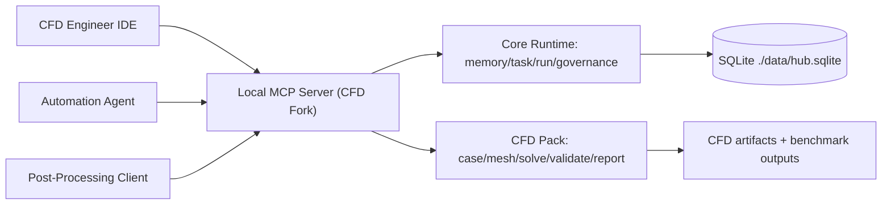

# MCPlayground: EXAMPLE CFD Analysis Server 

MCPlayground CFD Analysis Server is a local-first MCP server focused on Computational Fluid Dynamics workflows.

This repository is a CFD-focused fork of `MCPlayground---Core-Template`:

- Core runtime durability/governance is inherited from the template.
- `cfd` domain pack is enabled by default.

## What This Server Provides

- Durable CFD case lifecycle tools (`cfd.case.*`)
- Mesh registration and quality gates (`cfd.mesh.*`)
- Solver orchestration state (`cfd.solve.*`)
- QoI extraction and validation (`cfd.post.extract`, `cfd.validate.compare`)
- Reproducibility report bundles (`cfd.report.bundle`)
- Full continuity stack (`memory.*`, `transcript.*`, `run.*`, `task.*`, ADR/decision tools)

## Architecture Pitch

Use this stakeholder framing:

1. The server is local-first and deterministic.
2. All CFD lifecycle state is persisted in one local SQLite authority.
3. Multiple IDE/agent clients can coordinate through one runtime endpoint.
4. Safety, idempotency, and governance are built in at the platform layer.



## Quick Start

```bash
npm ci
npm run build
npm run start:stdio
```

HTTP mode:

```bash
npm run start:http
```

## Core and CFD Startup Commands

Default scripts start with CFD enabled:

- `npm run start`
- `npm run start:stdio`
- `npm run start:http`

Core-only fallbacks:

- `npm run start:core`
- `npm run start:core:http`

## Environment

```bash
cp .env.example .env
```

Important variables:

- `MCP_DOMAIN_PACKS=cfd` (enabled by default in this fork)
- `ANAMNESIS_HUB_DB_PATH` SQLite path
- `MCP_HTTP_BEARER_TOKEN` HTTP auth token
- `MCP_HTTP_ALLOWED_ORIGINS` local CORS policy

## CFD Tool Inventory

- `cfd.case.create`
- `cfd.case.get`
- `cfd.case.list`
- `cfd.mesh.generate`
- `cfd.mesh.check`
- `cfd.solve.start`
- `cfd.solve.status`
- `cfd.solve.stop`
- `cfd.post.extract`
- `cfd.validate.compare`
- `cfd.report.bundle`
- `cfd.schema.status`

## IDE and Agent Setup

See:

- [IDE + Agent Setup](./docs/IDE_AGENT_SETUP.md)
- [Transport Connection Guide](./docs/CONNECT.md)
- [Security Notes](./docs/SECURITY.md)
- [CFD Playbook](./docs/CFD_PLAYBOOK.md)
- [CFD Analyst Handoff](./docs/CFD_ANALYST_HANDOFF.md)
- [CFD Math Review Checklist](./docs/CFD_MATH_REVIEW_CHECKLIST.md)

## Read This Before Production Use

If your team will make engineering decisions from these outputs, review these two docs first:

1. [CFD Analyst Handoff](./docs/CFD_ANALYST_HANDOFF.md)
2. [CFD Math Review Checklist](./docs/CFD_MATH_REVIEW_CHECKLIST.md)

These identify where defaults are generic and where a CFD analyst should calibrate formulas, thresholds, and validation policy.

## Validation

```bash
npm test
npm run mvp:smoke
```
