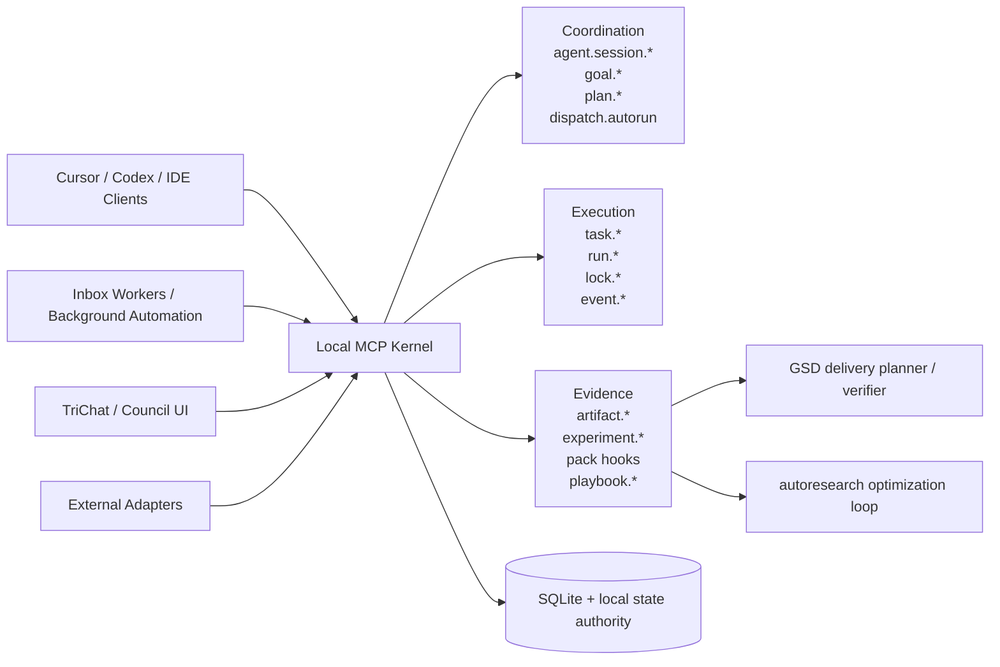

# Architecture Pitch

## Executive Summary

MCPlayground Core Template is a local-first MCP runtime for teams that need durable, governable workflows across multiple IDE and agent clients.

The architecture deliberately separates:

1. Universal runtime concerns (state continuity, idempotency, governance, tasking).
2. Domain-specific capabilities delivered as pluggable packs.

This pattern reduces project risk and accelerates new MCP server development.

## Problem It Solves

Without a reusable core, each MCP project tends to duplicate:

- persistence and run history
- task orchestration
- safety checks around writes/destructive actions
- cross-client continuity standards
- decision logging and ADR workflows

This template solves those once, then allows domain packs to focus on actual business or technical workflows.

## Design Principles

- Local-first by default.
- Durable history, not ephemeral prompt memory.
- Deterministic side effects via idempotent mutations.
- Explicit governance and verification checkpoints.
- Thin, composable domain extension model.

## Core Components

- MCP transport layer:
  - STDIO for single-client integrations.
  - HTTP for multi-client local access with bearer auth.
- SQLite durability layer:
  - Notes, transcripts, memories, tasks, runs, goals, plans, artifacts, experiments, events, and hook runs.
- Agentic kernel:
  - `agent.session.*`, `goal.*`, `plan.*`, `dispatch.autorun`.
- Evidence and measurement:
  - `artifact.*`, `experiment.*`, `event.*`.
- Governance and safety:
  - `policy.evaluate`, `preflight.check`, `postflight.verify`, `mutation.check`.
- Continuity and retrieval:
  - `memory.*`, `transcript.*`, `knowledge.query`, `retrieval.hybrid`, `who_knows`.
- Domain pack loader:
  - runtime registration from `MCP_DOMAIN_PACKS`.
- Workflow hooks and playbooks:
  - planner/verifier hooks plus methodology playbooks for GSD-style delivery and autoresearch-style optimization.

## Domain Pack Model

Domain packs register tools or workflow hooks into the same server process and DB while keeping clear namespace boundaries (`agentic.*`, `manufacturing.*`, etc.).

Each pack should:

- own its namespaced tool contracts
- keep pack-specific schema and metadata clearly separated
- reuse core primitives for idempotency, locks, runs, and policy checks

## Multi-Application Continuity

For continuity across IDEs and agents:

- point all clients at the same local MCP runtime
- require stable identifiers (`project_id`, `case_id`, `run_id`, `session_id`) in domain tools
- preserve source attribution (`source_client`, `source_model`, `source_agent`)
- route all writes through MCP tools, not direct DB writes
- treat TriChat as one backend client of the kernel, not the owner of orchestration
- let background workers and IDE clients claim the same routed task queue through `agent.session.*`

## Reliability and Auditability Narrative

- Every material operation can be represented by `run.begin -> run.step -> run.end`.
- Mutations are replay-safe with idempotency metadata.
- Governance tools persist checks and recommendations.
- ADR and decision links provide explicit rationale chains.
- Goals, plans, experiments, and artifacts provide a durable evidence graph instead of transcript-only reasoning.
- GSD and autoresearch can both execute through the same kernel because methodology is expressed as plans, hooks, tasks, and evidence, not separate chat silos.

## Stakeholder Talk Track

Use this in meetings:

1. We provide a core platform, not a single-purpose bot.
2. Domain packs let teams move fast without rebuilding reliability and governance.
3. Local-first architecture keeps data controlled on client machines.
4. Multi-client continuity is deterministic because all clients share one local state authority.
5. This lowers time-to-value for future MCP servers beyond the initial agentic workflow pack.
