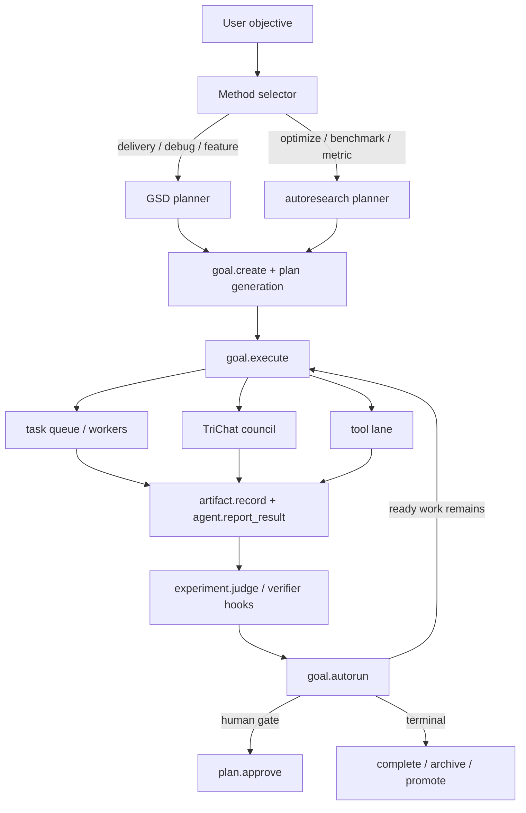

# Automated GSD + autoresearch Pipeline

## Objective

Use the local MCP kernel as the single execution authority for two methodology families:

- GSD-style delivery for feature work, debugging, and bounded implementation slices.
- autoresearch-style optimization for metric-driven experiments, benchmarking, and accept/reject loops.

The goal is not to copy those repos as prompt packs. The goal is to express their working patterns as durable goals, plans, tasks, artifacts, experiments, and approvals inside this runtime.

## Current Kernel Primitives

The runtime now has the minimum building blocks needed for a real automated pipeline:

- intent and coordination:
  - `goal.create`
  - `goal.execute`
  - `goal.autorun`
  - `goal.autorun_daemon`
  - `kernel.summary`
  - `plan.*`
  - `dispatch.autorun`
- execution lanes:
  - `agent.session.*`
  - `agent.claim_next`
  - `agent.report_result`
  - `task.*`
  - `trichat.*`
- evidence and measurement:
  - `artifact.*`
  - `experiment.*`
  - `event.*`
- methodology injection:
  - `playbook.*`
  - `playbook.run`
  - `pack.plan.generate`
  - `pack.verify.run`
  - default `agentic.*` planner/verifier hooks

## Core Thesis

GSD and autoresearch should be selected as planning modes, not as separate systems.

- GSD is the default delivery methodology when the objective is to ship, fix, refactor, investigate, or verify.
- autoresearch is the default optimization methodology when the objective names a metric, baseline, benchmark, prompt quality, speed, cost, accuracy, or experiment loop.
- both methodologies should run through the same kernel loop:
  - create a durable goal
  - generate or instantiate a plan
  - dispatch work into tools, workers, TriChat, and approvals
  - persist artifacts and experiment evidence
  - re-enter execution through `goal.autorun` or `goal.autorun_daemon` until the plan is blocked, failed, or complete

## Robust Automatic Flow

## Fool-Proof Design Rules

To make this safe and usable today, the pipeline should obey these rules:

1. One kernel, one source of truth.
   All clients, workers, and councils must write through MCP tools, never directly to SQLite.

2. Every methodology step emits evidence.
   Plans should name `expected_artifact_types`, and workers should always produce artifacts or task reports.

3. Optimization always requires a metric.
   autoresearch-style flows should fail fast if `metric_name`, directionality, or comparison criteria are missing.

4. Delivery and optimization stay reversible.
   GSD-style delivery should use bounded slices with explicit verification.
   autoresearch-style loops should use candidate runs plus accept/reject judgment.

5. Human approval is explicit, not implied.
   Any destructive or scope-committing action should block on `plan.approve`, not on hidden prompt logic.

6. Autorun only advances safe states.
   `goal.autorun` should continue ready goals, continue TriChat backend completion, and skip goals blocked on human approval or in-flight worker steps.

## Method Selection Strategy

The runtime should choose methodology in this order:

1. Explicit user selection.
   If the user asks for GSD, autoresearch, a named playbook, or a named planner hook, that wins.

2. Goal metadata and tags.
   `goal.metadata.methodology_source`
   `goal.metadata.preferred_planner_hook_name`
   tags like `autoresearch`, `optimization`, `experiment`, `delivery`, `debug`

3. Objective classification.
   Use lightweight heuristics:
   - delivery: feature, bug, refactor, integration, implementation, verify
   - optimization: improve, benchmark, score, latency, cost, accuracy, prompt, eval

## How GSD Should Run

GSD works best as the default delivery planner:

- use `agentic.delivery_path`
- generate bounded slices, not whole-project plans
- map the codebase before mutation
- require verification after implementation
- pause at explicit human approval before nontrivial mutation when the plan says so

Best fit:

- feature delivery
- repo exploration
- issue debugging
- refactors
- implementation review loops

## How autoresearch Should Run

autoresearch works best as an experiment controller:

- use `agentic.optimization_loop`
- create a durable experiment record first
- establish a baseline
- propose a bounded candidate
- run a benchmark task
- judge the candidate with `experiment.judge`
- only promote on measured improvement or explicit human acceptance

Best fit:

- prompt tuning
- verification quality improvements
- runtime performance
- cost and latency optimization
- benchmark-driven code changes

## What Is Automatic Now

These behaviors are now implemented in the shipped runtime:

- `goal.execute` can generate and dispatch methodology-aligned plans
- `goal.autorun` can re-enter eligible goals after async work finishes
- `goal.autorun_daemon` can run bounded unattended continuation ticks with persisted config
- `playbook.run` can create and enter methodology flows in one call
- worker completions attach artifacts, can derive experiment observations, and can re-enter bounded goals automatically
- the methodology can be inferred from goal metadata and tags
- optimization-oriented flows create the durable experiment ledger automatically
- `kernel.summary` reports goals, tasks, sessions, experiments, artifacts, and recent event pressure in one call
- worker completion is blocked when required `expected_artifact_types` are missing
- weak background lanes are prevented from silently owning higher-complexity tasks
- the pipeline can stop cleanly at human gates instead of free-running past them

## Current Operator Loop

For immediate use, the recommended loop is:

1. Create a goal directly, or use `playbook.run` when you want an opinionated GSD/autoresearch entrypoint.
2. Let `goal.execute` or `goal.autorun_daemon` generate and continue the plan.
3. Let agents claim work through `agent.claim_next` and report through `agent.report_result`.
4. Inspect `kernel.summary` when you want the whole operator picture.
5. Use `plan.approve` when a human gate is expected.
6. Run `npm run agentic:micro-soak` when you want a fast confidence check against the latest build.

## Remaining Hardening Opportunities

The highest-value follow-ons after this slice are:

1. Approval policy profiles.
   Make strict/bounded/aggressive policy modes first-class so approval behavior is configurable rather than only plan-shaped.

2. Richer evidence policies.
   Expand artifact expectations from presence checks into stronger verifier semantics, freshness, and artifact trust rules.

3. Adaptive worker assignment.
   Use live success/failure history to downgrade weak sessions automatically instead of only relying on static capability-tier inference.

4. Longer unattended burn-in.
   Use repeated micro-soaks and bounded daemon sessions to build confidence before longer overnight runs.

## Recommended Daily Test Loop

For the next four days, test this pipeline the same way every day:

1. Create one GSD-style delivery goal.
2. Create one autoresearch-style optimization goal with a real metric.
3. Run `goal.execute` once for each.
4. Let workers progress naturally.
5. Run `goal.autorun` or start `goal.autorun_daemon` to continue eligible work.
6. Review artifacts, events, and experiment verdicts.
7. Check `kernel.summary` and record where the pipeline stalled or needed manual patching.

That gives you a real feedback loop on orchestration quality instead of only checking whether tools exist.
