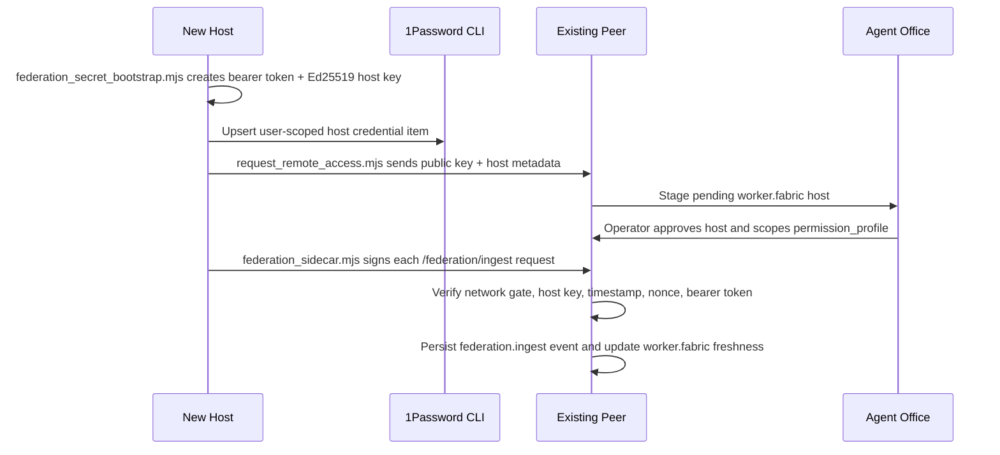

# MASTER-MOLD Federation Mesh

MASTER-MOLD federation is an ad-hoc peer mesh. There is no permanent central hub. Each host keeps its own local MCP server, local SQLite/event log, local desktop/context capture, and local authorization policy. A lightweight sidecar on each approved host publishes a bounded signed context stream to whichever peers it is configured to trust.

## Wire Diagram


## Trust Flow



## Team Bootstrap

Run this on each host that will participate in the mesh:

```bash
npm run federation:secrets:bootstrap -- \
  --vault Employee \
  --host-id my-host \
  --peers http://peer-a.local:8787,http://peer-b.local:8787 \
  --write-env
```

The script assumes `op` is installed and unlocked on that host. Use `--op-path /path/to/op` when SSH or launchd does not inherit the normal shell PATH.

For the first same-day mesh, use a shared MCP bearer token across the whitelisted peers or run a separate sidecar process per peer/token. The Ed25519 host signature is still the durable host identity; the bearer token is the HTTP transport gate. To seed a shared token on a host, pass `--shared-bearer-token` or set `MASTER_MOLD_FEDERATION_SHARED_BEARER_TOKEN` before running the bootstrap script.

The script performs these local actions:

- Creates or reuses `data/imprint/http_bearer_token` with `0600` permissions.
- Creates or reuses `~/.master-mold/identity/<host-id>-ed25519.pem`.
- Saves the bearer token, private key, public key, host ID, hostname, workspace path, and peer list into a 1Password API Credential item.
- Optionally writes only non-secret federation settings into `.env`.

After secrets exist, request access from each peer that should trust this host:

```bash
node scripts/request_remote_access.mjs \
  --server http://peer-a.local:8787 \
  --host-id my-host \
  --workspace-root "$PWD" \
  --identity-key-path ~/.master-mold/identity/my-host-ed25519.pem
```

Approve the pending host in Agent Office. Then start the sidecar:

```bash
npm run federation:sidecar -- --once
npm run federation:launchd:install
```

## Payload Boundary

The sidecar intentionally streams a compact subset by default:

- `kernel.summary` highlights.
- Recent runtime event headers and summaries, excluding federation echo events.
- `desktop.context` freshness, source, frame paths, and stale/unavailable reasons.
- Host identity metadata such as host ID, hostname, agent runtime, and model label.

It does not stream raw screenshots, raw transcripts, full memory stores, or broad filesystem content by default. Peers can use the received context as a routing and awareness signal, then request more authoritative information through explicit MCP tools when authorized.
