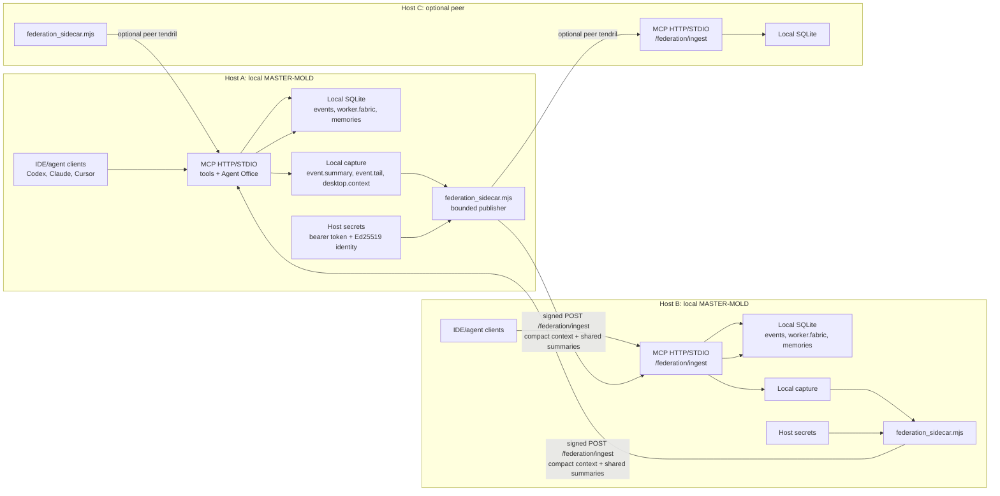
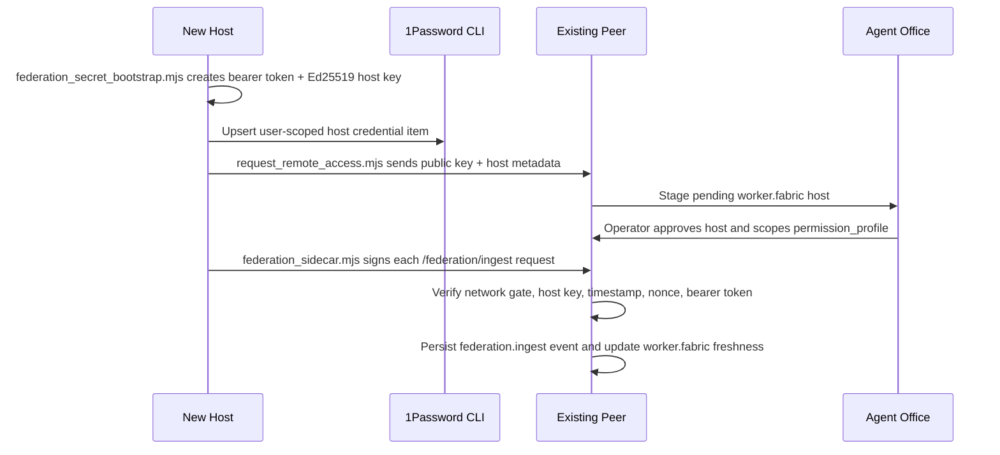

# MASTER-MOLD Federation Mesh

MASTER-MOLD federation is an ad-hoc peer mesh. There is no permanent central hub. Each host keeps its own local MCP server, local SQLite/event log, local desktop/context capture, and local authorization policy. A lightweight sidecar on each approved host publishes a bounded signed context stream to whichever peers it is configured to trust.

## Wire Diagram



## Trust Flow



## Team Bootstrap

Run this on each host that will participate in the mesh:

```bash
npm run federation:onboard -- \
  --vault Employee \
  --host-id my-host \
  --peer http://peer-a.local:8787 \
  --peer http://peer-b.local:8787
```

`federation:onboard` is the coworker-friendly path. It checks Node/npm/git and `op`, creates or reuses the host identity, writes only non-secret federation settings into `.env`, requests remote access on each peer, runs the sidecar once, runs `federation:doctor`, and prints the exact next step. The command is resumable: rerunning it reuses the identity/env material and advances the first failed step instead of asking the operator to manually chain bootstrap, request, sidecar, and doctor commands.

Use `--require-1password` when a team rollout must fail closed if 1Password CLI is unavailable. Without it, onboarding falls back to local identity files and reports the 1Password status explicitly without printing secret values.

The lower-level bootstrap remains available when you need to seed or inspect one step manually:

```bash
npm run federation:secrets:bootstrap -- \
  --vault Employee \
  --host-id my-host \
  --peers http://peer-a.local:8787,http://peer-b.local:8787 \
  --write-env
```

The script prefers `op` when 1Password CLI is installed and unlocked on that host. Use `--op-path /path/to/op` when SSH or launchd does not inherit the normal shell PATH. If 1Password is missing, locked, or not configured, the bootstrap now still creates the local bearer token and Ed25519 host key, reports `one_password.status="unavailable"`, and leaves recovery material in local files only. Pass `--require-1password` when a team rollout should fail closed instead, or `--local-only` for an intentional local-file bootstrap.

For the first same-day mesh, use a shared MCP bearer token across the whitelisted peers or run a separate sidecar process per peer/token. The Ed25519 host signature is still the durable host identity; the bearer token is the HTTP transport gate. To seed a shared token on a host, pass `--shared-bearer-token` or set `MASTER_MOLD_FEDERATION_SHARED_BEARER_TOKEN` before running the bootstrap script.

The script performs these local actions:

- Creates or reuses `data/imprint/http_bearer_token` with `0600` permissions.
- Creates or reuses `~/.master-mold/identity/<host-id>-ed25519.pem`.
- Saves the bearer token, private key, public key, host ID, hostname, workspace path, and peer list into a 1Password API Credential item when `op` is available.
- Optionally writes only non-secret federation settings into `.env`.

After secrets exist, request access from each peer that should trust this host:

```bash
node scripts/request_remote_access.mjs \
  --server http://peer-a.local:8787 \
  --host-id my-host \
  --workspace-root "$PWD" \
  --identity-key-path ~/.master-mold/identity/my-host-ed25519.pem
```

Approve the pending host in Agent Office. Then start the sidecar:

```bash
npm run federation:sidecar -- --once
npm run federation:launchd:install
```

Before inviting another teammate into the mesh, run the doctor on each already-approved peer:

```bash
npm run federation:doctor
npm run federation:doctor -- --ssh-probe
npm run federation:doctor -- --json
```

The doctor checks local bearer-token/key presence, local host-ID drift versus available Ed25519 keys, sidecar launchd install/load state, 1Password CLI availability, approved `worker.fabric` hosts, signed identity coverage, latest federation ingest freshness, current DNS/locator state, desktop-context freshness, the local sidecar send ledger, and optional SSH liveness. It intentionally reports the current socket/DNS address separately from the approved-time IP because addresses move; durable trust should come from hostname, device fingerprint, MAC-style hardware evidence, and the signed Ed25519 host identity.

Each sidecar run now records a bounded per-peer send ledger in `data/federation/<host-id>-sidecar-state.json`, including the last attempt time, last successful publish, HTTP status, and consecutive failures for each peer. `federation:doctor` reads that file so stale ingest can be separated into "the sidecar never ran here", "publishes are failing", and "publishes are succeeding but the peer freshness is still old".

Agent Office shows the same durable sidecar state under Hosts/Federation. Use the built-in controls to run the sidecar once, repair the launchd sidecar, refresh the doctor, clear a stale Office cache, repair missing build artifacts, repair the local HTTP lane, and refresh provider configuration. The UI keeps durable host identity, approved-time locator metadata, current locator, stale/degraded state, and last sidecar error separate.

Repeatable soak and repair commands:

```bash
npm run federation:soak -- --peer http://peer-a.local:8787 --peer http://peer-b.local:8787 --iterations 3 --json
npm run federation:soak -- --peer http://peer-a.local:8787 --apply
npm run federation:repair -- --action all --json
npm run federation:repair -- --action sidecar-stale --peer http://peer-a.local:8787
npm run federation:benchmark -- --hosts 3 --events-per-host 80 --json
```

The soak command runs sidecar one-shot loops, an isolated offline-peer simulation, doctor before/after checks, and either local restart guidance or bounded restart actions when `--apply` is set. Sleep/wake and network-change checks remain operator-mediated because automatically toggling a coworker's network or sleep state is unsafe. The benchmark command uses a temporary database with simulated multi-peer ingest history and times `office.snapshot`, `kernel.summary`, `knowledge.query`, and `federation:doctor`; it does not claim live remote validation.

Each accepted federation ingest event records a first-class identity envelope: `requesting_host_id`, `requesting_remote_address`, `captured_from_host_id`, `captured_hostname`, `captured_agent_runtime`, `captured_model_label`, `signed_at`, `received_at`, `signature_verification_result`, and the approved whitelist scope. The receiver derives that envelope from the approved network gate and verified host signature, not from caller-provided `source_*` fields.

## Shared Context Plane

The federation sidecar exists to make agents on different hosts aware of useful local state without requiring the operator to manually brief every machine. It does this by publishing bounded, signed summaries from each host into the peers that have explicitly approved that host.

The received summaries are queryable through `knowledge.query`. They are intentionally not merged into the local memory store as if they were native facts. `who_knows` stays local by default, while `knowledge.query` can include signed federated matches with the source host, hostname, runtime/model label, signature verification result, approval scope, receive time, and source event id.

Every imported record must retain:

- provenance: source host, hostname, runtime/model label, source event id, and receive time
- trust: signature verification result and approval scope
- scope: kind of summary (`memory`, `goal`, `task`, or `capability`) and the bounded sidecar limits used
- freshness: generated/updated timestamps from the origin host plus receive time on the ingesting peer

Use this plane for awareness and routing: recent memories, active or blocked goals, non-terminal or recently updated tasks, blocker summaries, capability/freshness clues, and compact runtime-event headers. `knowledge.query` can filter imported context by source host, freshness, goal/task/blocker/capability focus, status, trust status, and provenance. Do not use it for raw transcript replication, raw screenshots, full memory stores, broad filesystem content, secrets, or caller-declared identity.

## Payload Boundary

The sidecar intentionally streams a compact subset by default:

- `event.summary` counts and latest event sequence as the default local MCP liveness/context proof.
- Recent runtime event headers and summaries, excluding federation echo events.
- `desktop.context` freshness, source, frame paths, and stale/unavailable reasons.
- `shared_summaries` for recent memory previews, active/non-terminal goal headers, non-terminal task headers, and one compact capability summary.
- Host identity metadata such as host ID, hostname, agent runtime, and model label.

It does not stream raw screenshots, raw transcripts, full memory stores, or broad filesystem content by default. Peers can use the received context as a routing and awareness signal, then request more authoritative information through explicit MCP tools when authorized.

Before adding a coworker Mac, the already-approved side should be green on:

```bash
npm run federation:doctor -- --json --ssh-probe
node --test tests/http_transport_ready_cache.test.mjs tests/federated_query.integration.test.mjs tests/federation_sidecar.test.mjs tests/federation_sidecar_state.test.mjs tests/federation_mesh_doctor.test.mjs
```

Those checks cover signed ingest, path-bound signatures, replay protection, body-size rejection, host-not-staged operator hints, sidecar ack/retry state, doctor truth, and signed federated summaries through `knowledge.query`.
