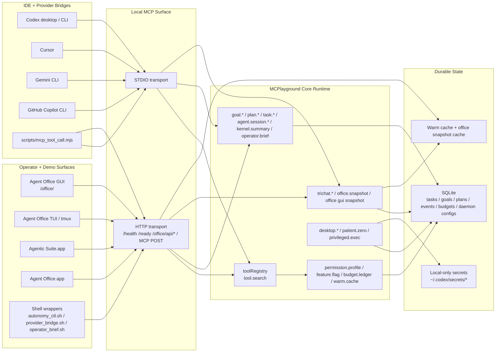
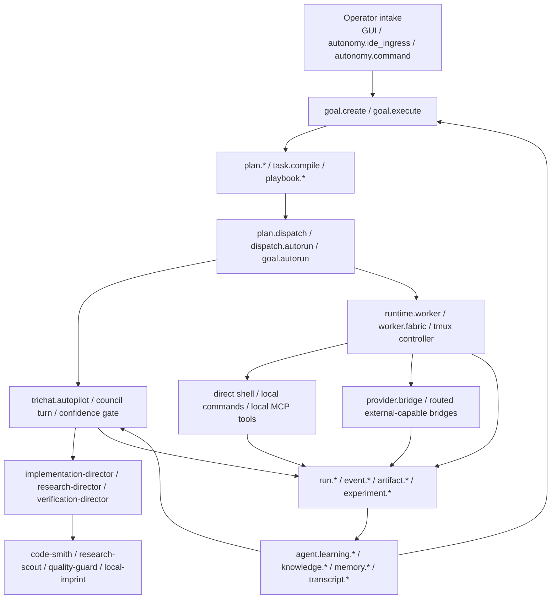
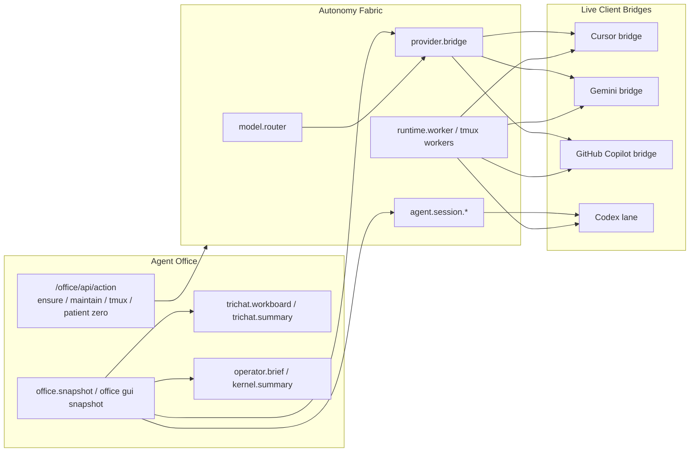
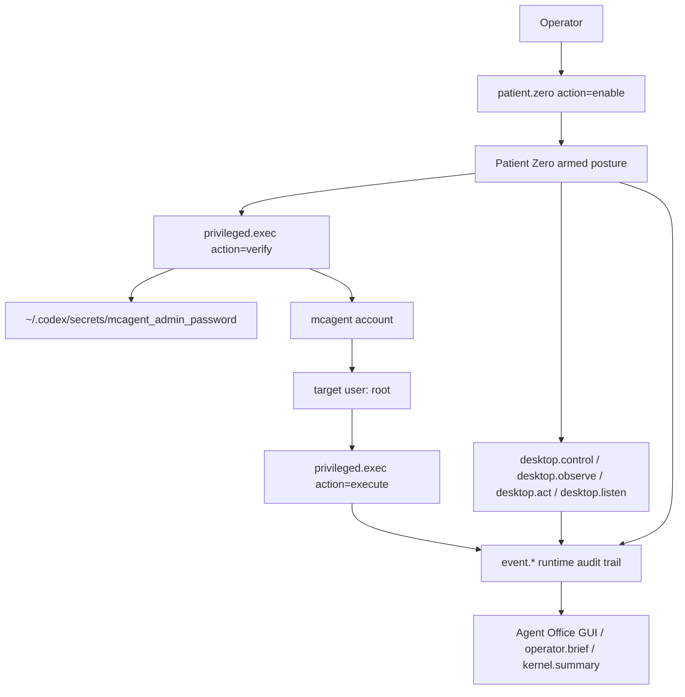

# System Interconnects

This document is the current operator/demo reference for how the local MCP runtime, office surfaces, IDE bridges, autonomy fabric, and host-control lanes connect.

## 1. Control Plane Topology

## 2. Autonomy and Agentic Fabric

## 3. Office + Bridge Connectivity

## 4. Local Host Control and Patient Zero

## 5. Operational Notes

- `/ready` is the authoritative HTTP readiness gate for the office launcher and automation wrappers.
- `/health` is intentionally cheap and only proves that the listener is alive.
- `/office/api/snapshot` serves cached snapshots by default and uses explicit live refreshes sparingly to avoid saturating the daemon.
- `patient.zero` does not silently grant root. Root becomes available only when:
  - Patient Zero is armed.
  - the `mcagent` secret exists outside the repo and SQLite.
  - the `privileged.exec` verifier has proved the `mcagent -> root` path.
- Every privileged verification and execution attempt is written into the runtime event trail.
