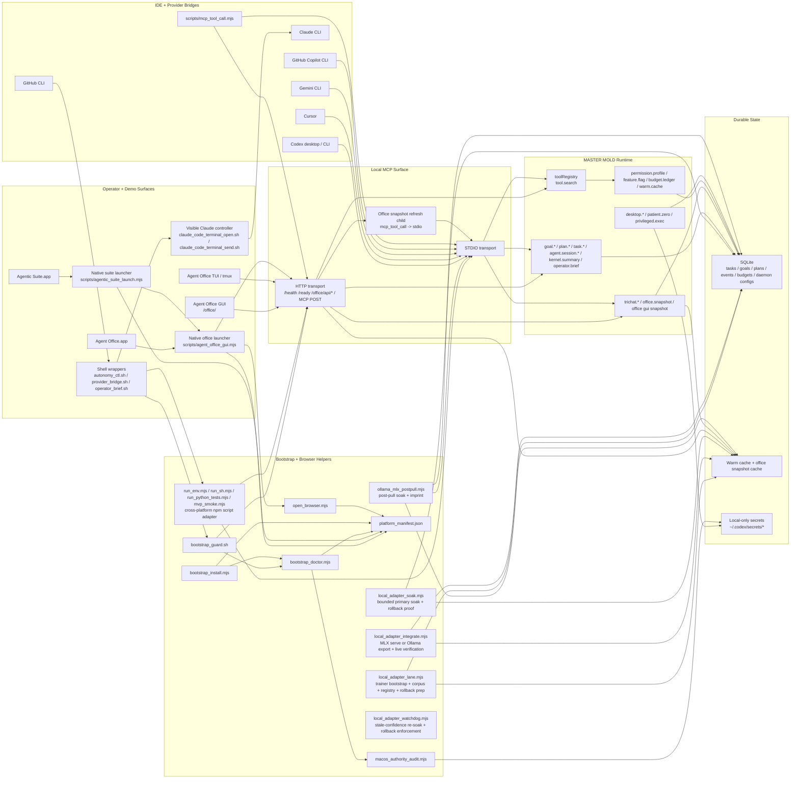
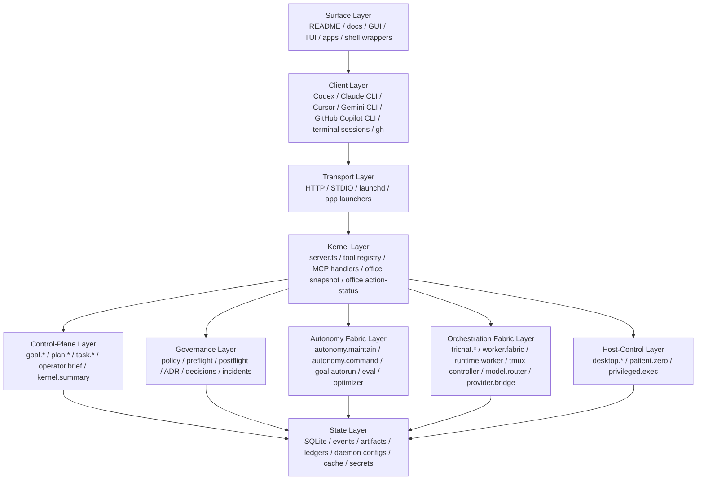
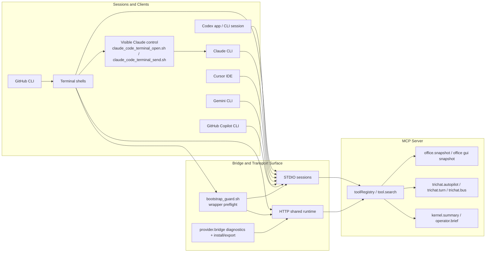
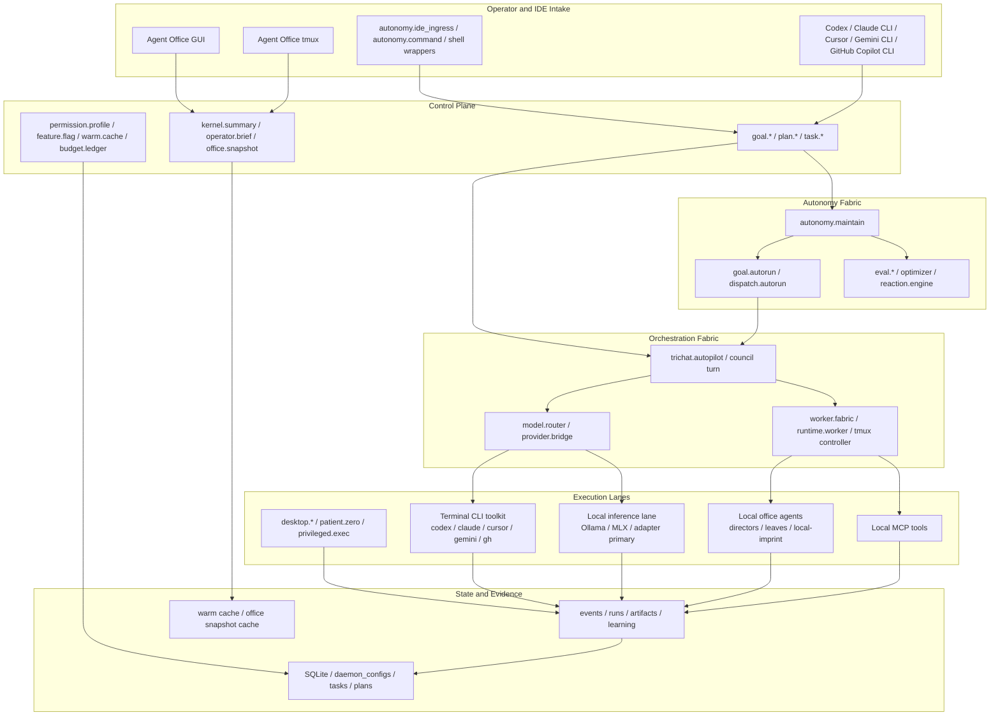
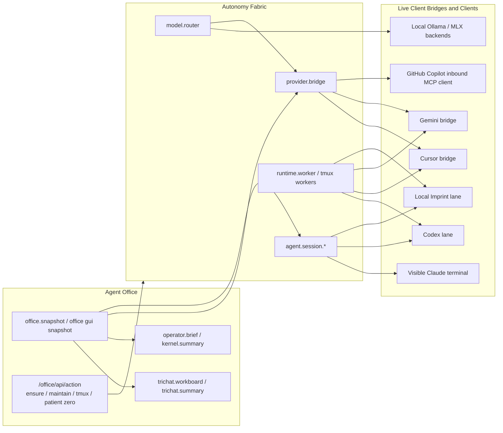
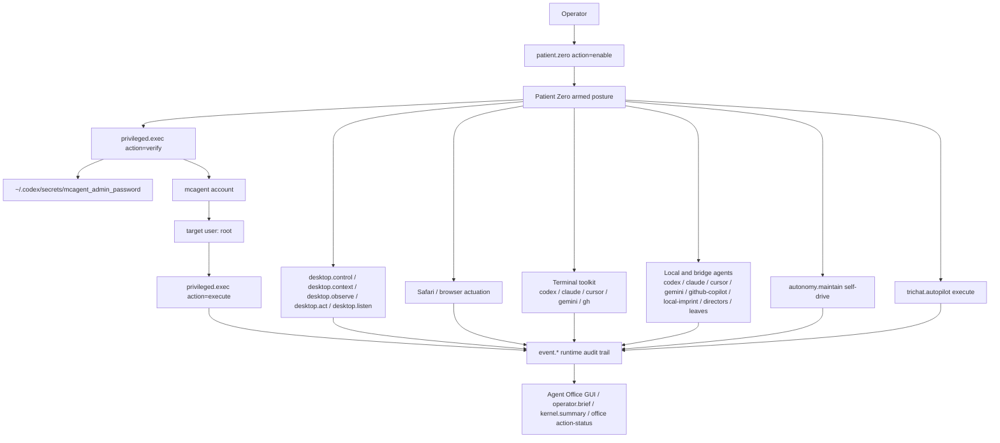

# System Interconnects

This document is the current operator/demo reference for how the local MCP runtime, office surfaces, IDE bridges, terminal sessions, autonomy fabric, orchestration fabric, and host-control lanes connect.

Start here for the centralized docs map: [Documentation Index](./README.md)

## 1. Control Plane Topology

The Office GUI is a visibility surface for operators. Its readiness tracks the MCP HTTP surface and launcher path, not the stricter Patient Zero browser-actuation lane. Browser automation can be degraded while `/office/` remains healthy and truthful.

Patient Zero full authority is also gated by macOS-owned permissions. The repo now exposes that explicitly through `macos_authority_audit.mjs` instead of implying that an armed banner bypasses Accessibility, Screen Recording, microphone/listen-lane consent, Full Disk Access, or the `mcagent` root-helper + secret path.
For Screen Recording, live proof now requires an actual screenshot capture event (`desktop.observe` with `action="screenshot"`), not generic observation timestamps from frontmost-app or clipboard probes.
`desktop.context` is the shared MCP screen-context surface for Codex, Claude Code, Cursor, and other MCP clients. It can read a live Chronicle rolling buffer when that recorder is present and fresh, but Chronicle is optional and never becomes a hard runtime dependency; when Chronicle is unavailable or stale, `desktop.context` can fall back to a logged `desktop.observe` screenshot capture. The returned contract includes source, freshness, display/frame paths, noisy OCR hit summaries only when requested, authority summary, stale/unavailable reasons, recommended next action, and the runtime event id that makes the observation visible across clients.
For N-host operation, remote clients request access with `scripts/request_remote_access.mjs` or `POST /remote-access/request`; that path can only stage a pending host with sanitized metadata and never approves it. The main Mac approves hosts from Agent Office, and HTTP MCP sessions are then bound to the validated network host identity instead of trusting caller-supplied `source_*` attribution. Approved hosts can be used as `desktop.context host_id=<host>` context sources only when they also carry explicit desktop-context permission, and `scripts/remote_host_bootstrap_verify.sh` provides the SSH/repo/build/context-probe handshake for new hosts such as `Dans-MBP.local`.

The local adapter lane is now split into seven explicit phases: `prepare -> train -> promote -> integrate -> cutover -> soak -> watchdog`. `Integrate` makes a candidate reachable; `cutover` is the separate router-default switch with post-cutover verification and rollback; `soak` is the bounded confidence pass that keeps comparing the new primary against the rollback path before you trust it as a settled default; `watchdog` is the lightweight freshness-enforcement path that reruns soak automatically when that proof gets stale. On macOS, that watchdog now has a dedicated launchd agent, so the freshness contract survives login churn and machine restarts instead of depending on an interactive shell.

## 2. Layered Runtime Stack

## 3. IDE and Terminal Session Flow

## 4. Autonomy, Orchestration, and Execution Fabrics

## 5. Office + Bridge Connectivity

## 6. Local Host Control and Patient Zero

## 7. Operational Notes

- `/ready` is the authoritative HTTP readiness gate for the office launcher and automation wrappers.
- `/health` is intentionally cheap and only proves that the listener is alive.
- `/office/api/snapshot` serves cached snapshots by default and uses explicit live refreshes sparingly to avoid saturating the daemon.
- `/office/api/action-status` is the live rally/dispatch truth surface for the office. The GUI now treats it as authoritative while a background intake or action is still running, then falls back to snapshot telemetry once that action settles.
- The launchd HTTP runner sets `MCP_HTTP_OFFICE_SNAPSHOT_REFRESH_MODE=stdio`, but the office GUI now prefers a direct raw-snapshot-to-GUI transform when that lane is available and only falls back to the nested STDIO child when it must. This keeps the operator surface alive when the child lane is noisy or slow.
- Office actions no longer depend on an immediate post-submit snapshot refresh. The GUI now renders running action state directly and lets the normal refresh cadence pull updated snapshot telemetry after settlement.
- `scripts/agent_office_gui.mjs` is the cross-platform office launcher path for macOS, Linux, and win32. It prefers launchd on macOS when available and falls back to the detached Node HTTP runner everywhere else.
- `Agent Office.app` and `Agentic Suite.app` are thin installed wrappers that invoke the Node launchers; they do not bypass the launcher logic or talk to the MCP HTTP listener directly.
- `scripts/agentic_suite_launch.mjs` is the cross-platform suite/app launcher. It first ensures the office surface is available, then tries requested IDE windows, then reuses the office launcher for browser fallback, while `status` emits machine-readable readiness with next actions.
- `scripts/claude_code_terminal_open.sh` opens an operator-visible Claude Code Terminal session on macOS so the operator can watch Claude directly.
- `scripts/claude_code_terminal_send.sh` focuses that live Claude tab, clears the current line, types a bounded prompt, and presses Enter. Use it when you want Codex-to-Claude collaboration to stay readable in the Terminal instead of hiding behind one-shot shell calls.
- `scripts/bootstrap_doctor.mjs` reads `scripts/platform_manifest.json` as the bootstrap source of truth for browser detection order, launcher entrypoints, install profiles, and platform capability notes.
- `scripts/bootstrap_install.mjs` is the platform-aware first-run installer path used by `npm run bootstrap:env:install`; it consumes the same manifest and can install pinned Node/npm/Python/Git/tmux prerequisites for supported hosts.
- `scripts/bootstrap_guard.sh` is sourced by cold-start shell wrappers such as `provider_bridge.sh` and `autonomy_ctl.sh`. It fails early with `npm run bootstrap:env` guidance when Node MCP client dependencies or `dist/server.js` are missing, instead of leaking low-level Node import/build errors.
- `npm run providers:diagnose -- <client>` now refreshes stale bridge evidence live over stdio/CLI when it is safe to do so. The shared HTTP daemon still prefers cached truth for responsiveness, so operator-triggered diagnose and daemon-facing status no longer have to make the same latency tradeoff.
- `routeObjectiveBackends()` now suppresses automatic hosted-bridge augmentation when a local Ollama/MLX-class backend wins and the operator did not explicitly ask for hosted providers. That keeps cheap local inference as the first-pass lane while preserving explicit bridge targeting through `trichat_agent_ids` and Agent Office `Bridge targets`.
- `scripts/open_browser.mjs` now prefers the OS default browser handler first (`open`, `xdg-open`, `start`) and only falls back to named browser detection when needed, while still supporting `%LOCALAPPDATA%` and registry-backed win32 browser installs.
- GitHub Copilot is represented as an inbound MCP client surface in `provider.bridge`; it is not routed as an outbound council/model-router backend until a real outbound bridge contract exists.
- `scripts/agent_office_gui.sh` remains as a thin compatibility wrapper around the Node launcher for older shell entrypoints.
- `scripts/agentic_suite_launch.sh` remains as a thin compatibility wrapper around the Node suite launcher for older shell entrypoints.
- `patient.zero` does not silently grant root. Root becomes available only when:
  - Patient Zero is armed.
  - the `mcagent` secret exists outside the repo and SQLite.
  - the `privileged.exec` verifier has proved the `mcagent -> root` path.
- When Patient Zero is armed, it also widens the active autonomy toolkit by enabling:
  - maintain self-drive
  - autopilot execute posture
  - the terminal CLI toolkit (`codex`, `cursor`, `gemini`, `gh`)
  - the local and bridge specialist pool, including `local-imprint`
- Every privileged verification and execution attempt is written into the runtime event trail.
