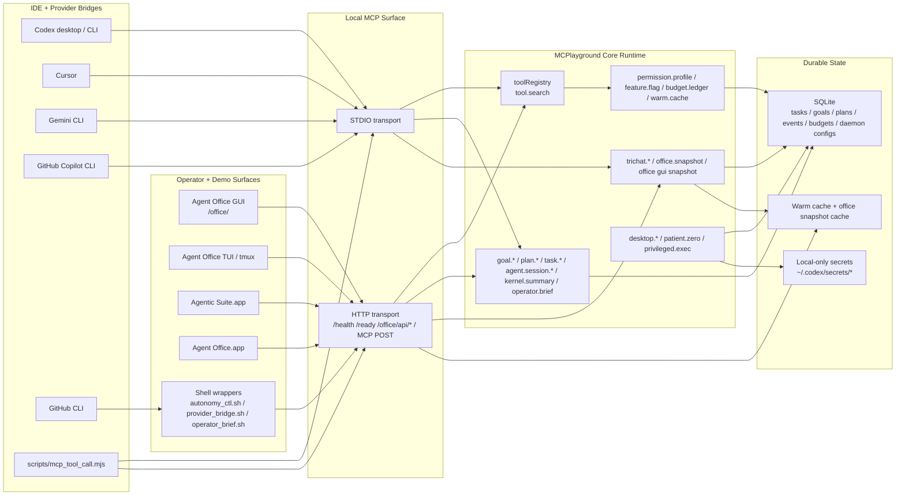
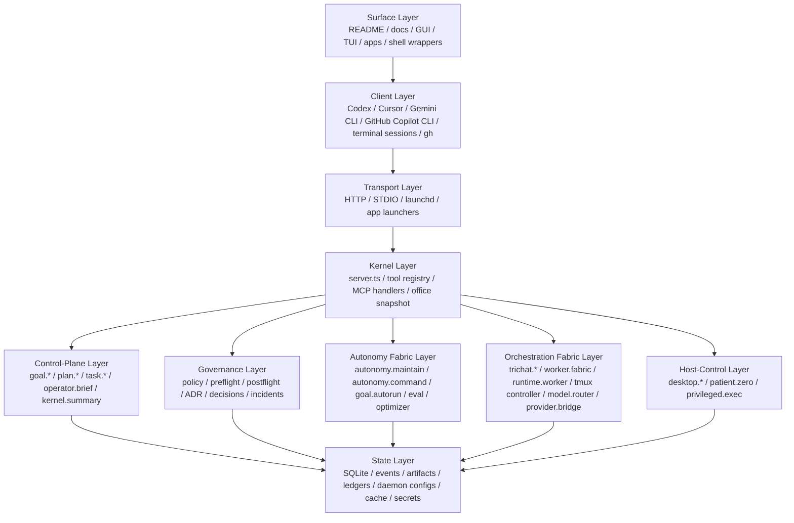
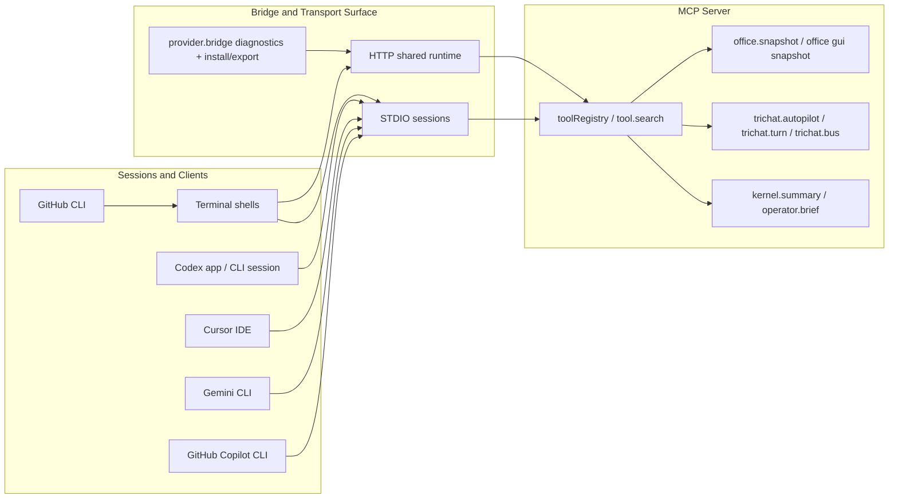
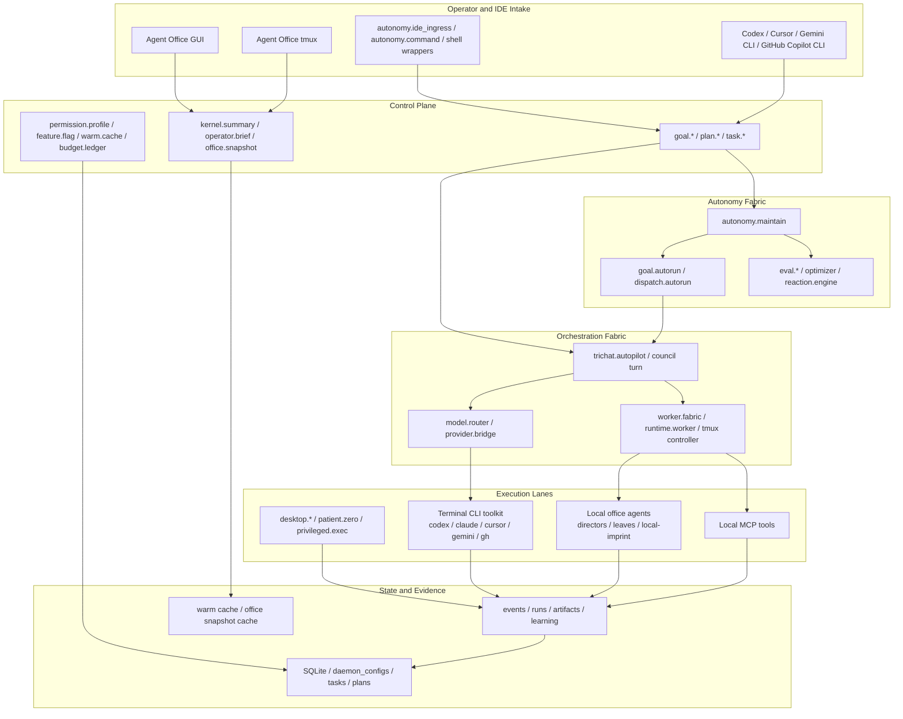
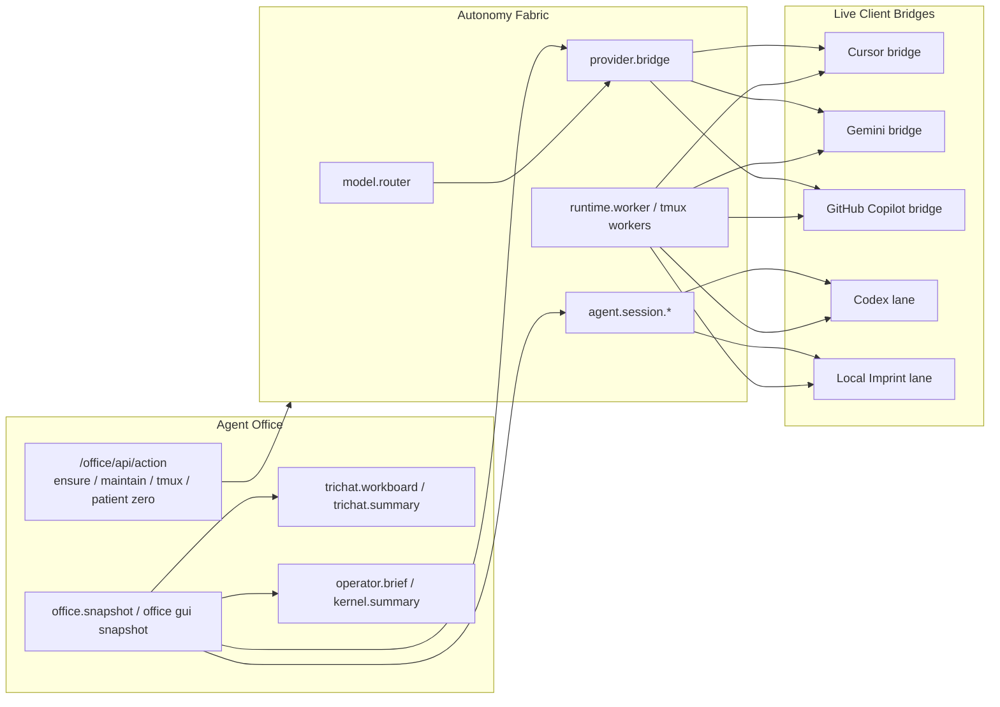
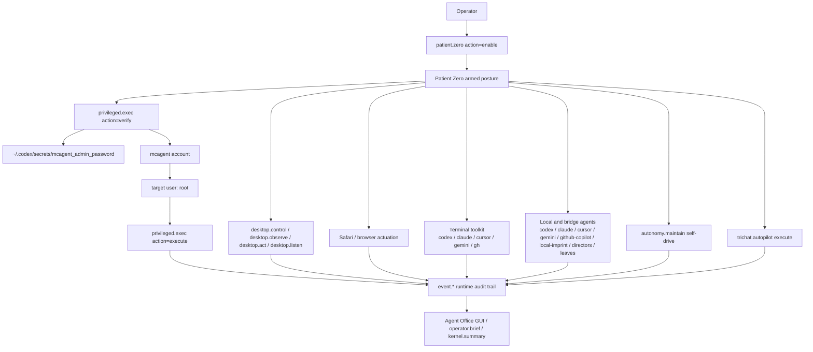

# System Interconnects

This document is the current operator/demo reference for how the local MCP runtime, office surfaces, IDE bridges, terminal sessions, autonomy fabric, orchestration fabric, and host-control lanes connect.

Start here for the centralized docs map: [Documentation Index](./README.md)

## 1. Control Plane Topology

## 2. Layered Runtime Stack

## 3. IDE and Terminal Session Flow

## 4. Autonomy, Orchestration, and Execution Fabrics

## 5. Office + Bridge Connectivity

## 6. Local Host Control and Patient Zero

## 7. Operational Notes

- `/ready` is the authoritative HTTP readiness gate for the office launcher and automation wrappers.
- `/health` is intentionally cheap and only proves that the listener is alive.
- `/office/api/snapshot` serves cached snapshots by default and uses explicit live refreshes sparingly to avoid saturating the daemon.
- `patient.zero` does not silently grant root. Root becomes available only when:
  - Patient Zero is armed.
  - the `mcagent` secret exists outside the repo and SQLite.
  - the `privileged.exec` verifier has proved the `mcagent -> root` path.
- When Patient Zero is armed, it also widens the active autonomy toolkit by enabling:
  - maintain self-drive
  - autopilot execute posture
  - the terminal CLI toolkit (`codex`, `cursor`, `gemini`, `gh`)
  - the local and bridge specialist pool, including `local-imprint`
- Every privileged verification and execution attempt is written into the runtime event trail.
